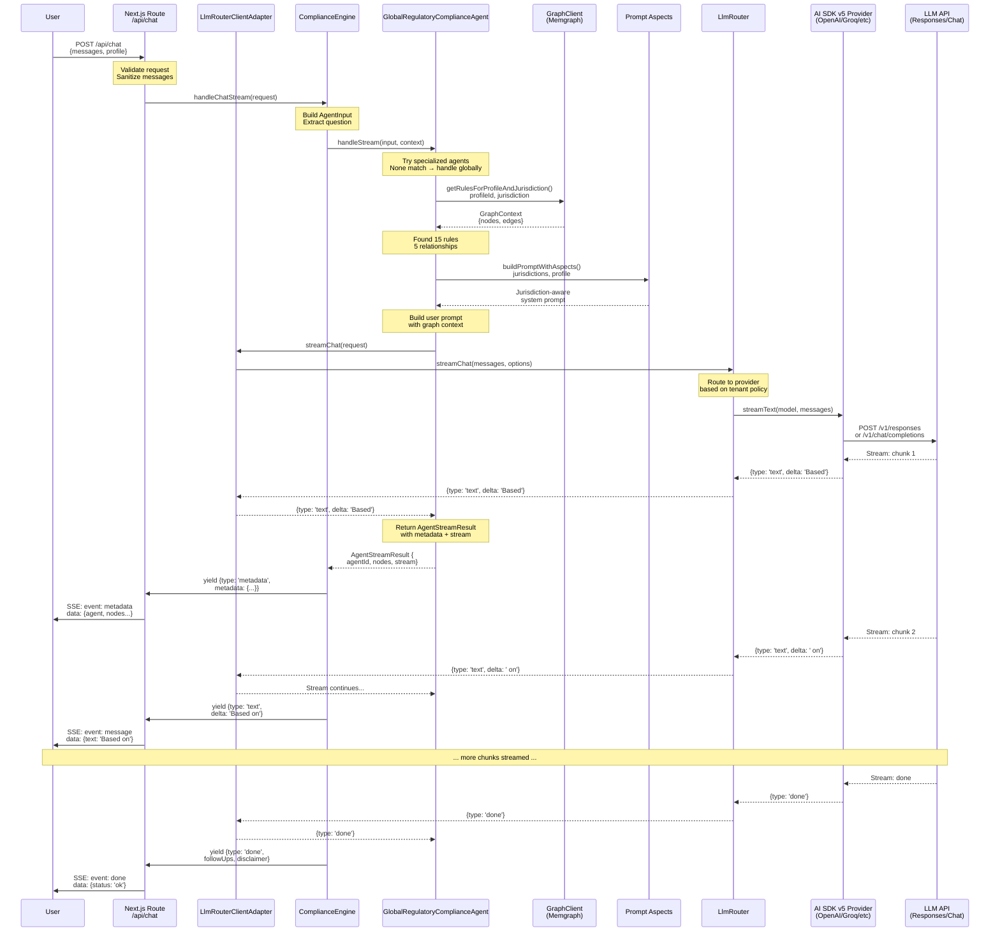
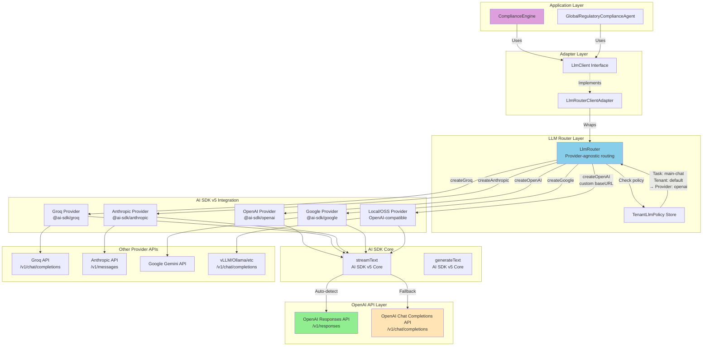
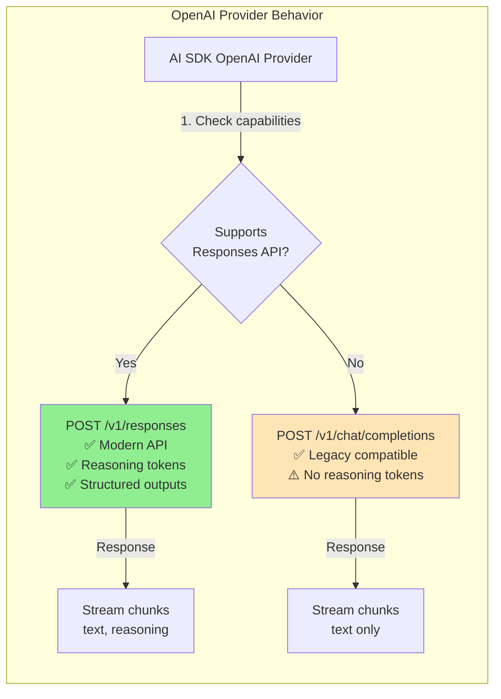
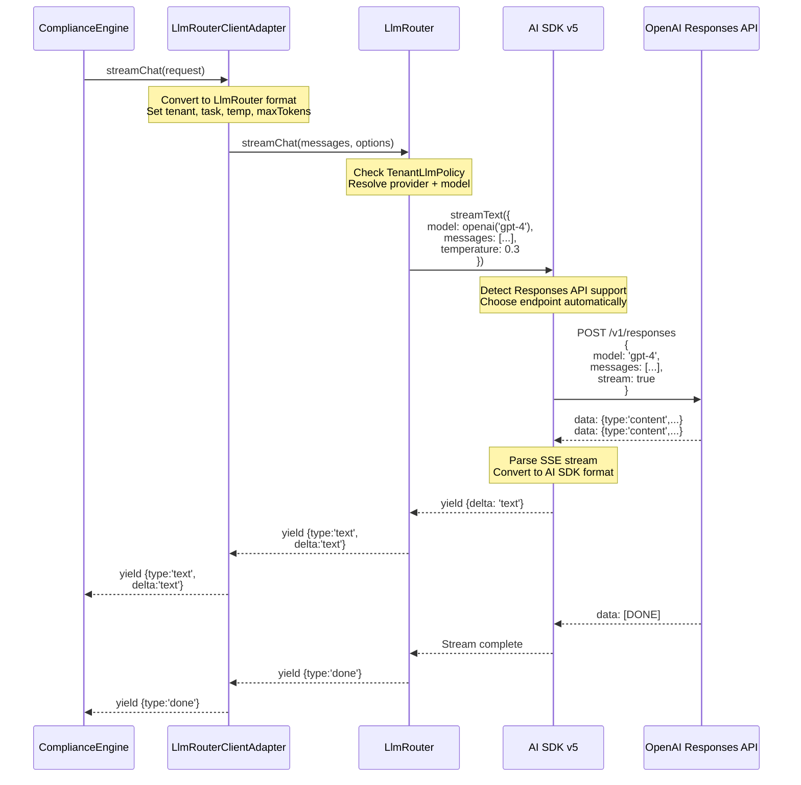
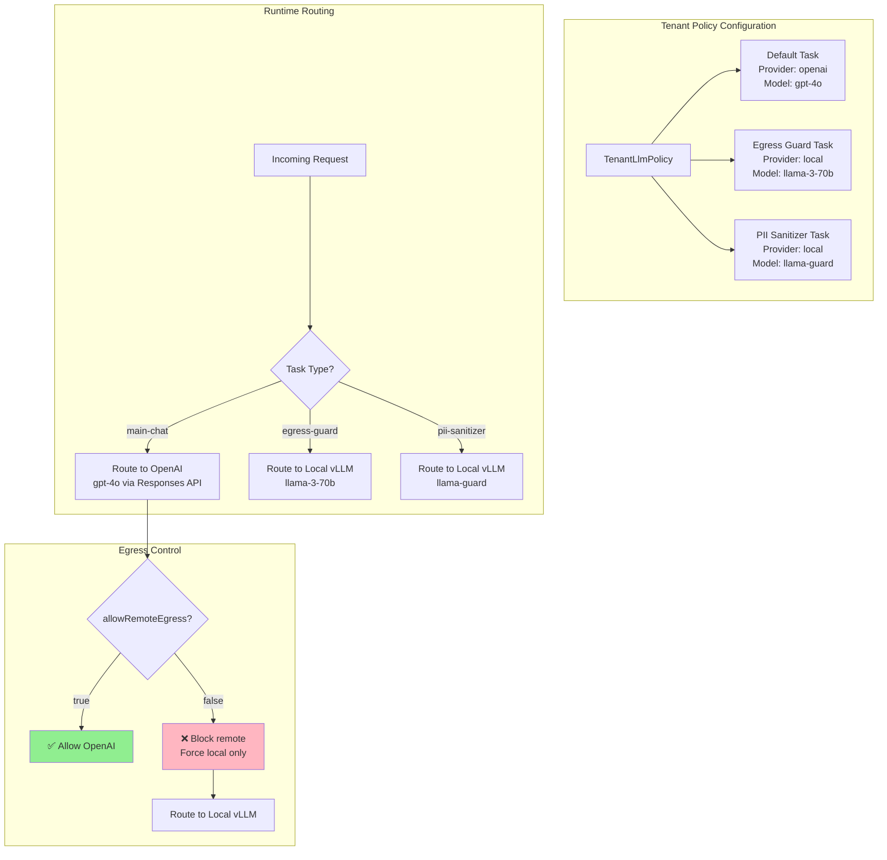
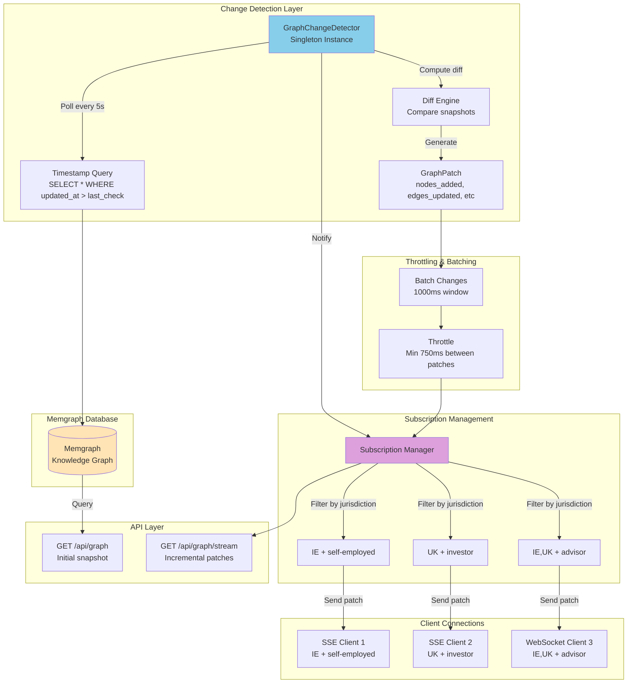
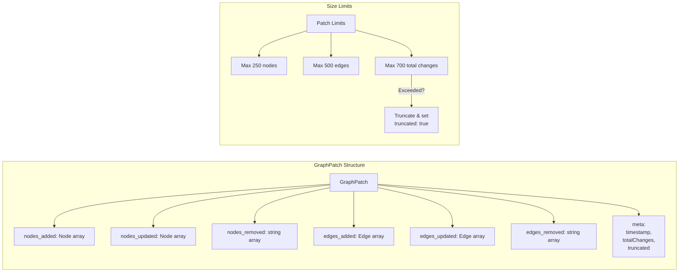
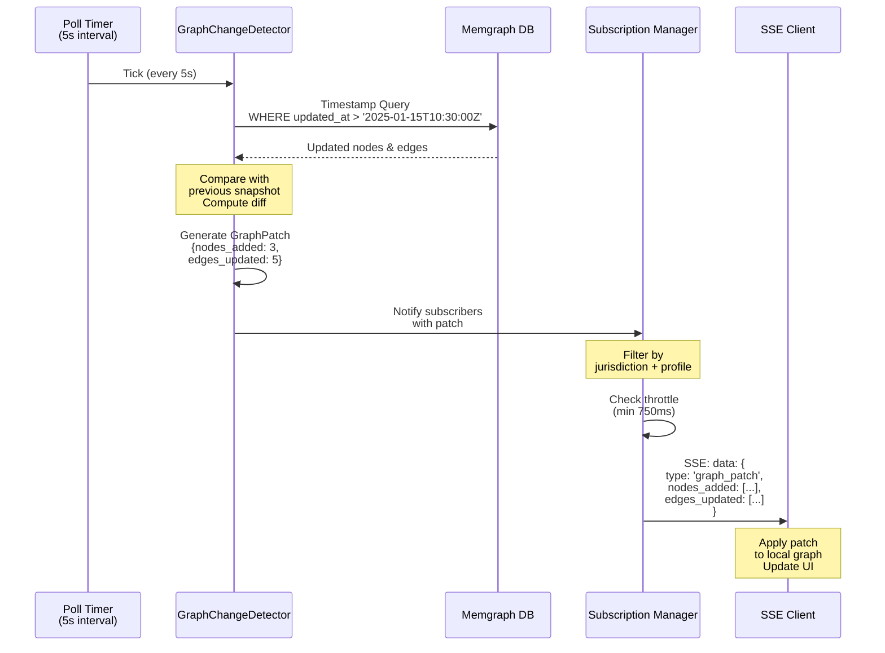
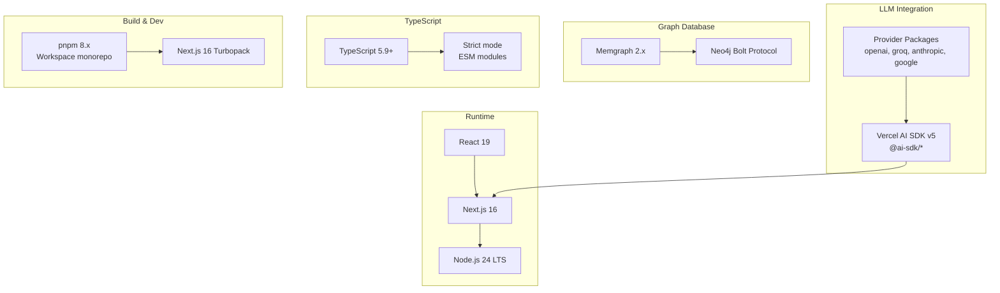

# Architecture Diagrams - v0.4

This document contains detailed Mermaid diagrams showing the v0.4 architecture flow and LLM provider integration.

## Table of Contents

1. [Complete Request Flow](#complete-request-flow)
2. [LLM Provider Architecture](#llm-provider-architecture)
3. [Graph Streaming Architecture](#graph-streaming-architecture)

---

## Complete Request Flow

This diagram shows the complete flow of a chat request through the v0.4 architecture, including ComplianceEngine routing, agent execution, graph queries, and streaming responses.

### Key Architectural Points

1. **No Bypass**: Request flows through ComplianceEngine → Agent → Graph → LLM
2. **Graph Context**: Agent queries Memgraph before calling LLM
3. **Metadata First**: Client receives agent info and graph nodes before text
4. **Streaming**: LLM response streamed in real-time through all layers
5. **Prompt Aspects**: Jurisdiction-aware prompts built dynamically

---

## LLM Provider Architecture

This diagram shows how the LlmRouter integrates with Vercel AI SDK v5 and various providers, including the OpenAI Responses API.

### Provider Details

#### OpenAI Responses API vs Chat Completions

### Streaming Flow Through Layers

### Multi-Provider Routing

---

## Graph Streaming Architecture

This diagram shows the real-time graph streaming infrastructure for pushing incremental updates to clients.

### Graph Patch Format

### Change Detection Flow

---

## Technology Stack

### Core Dependencies

---

## Summary

These diagrams illustrate:

1. **Complete Request Flow**: End-to-end journey from user request through ComplianceEngine, agents, graph queries, and streaming LLM responses

2. **LLM Provider Architecture**: Multi-provider support via AI SDK v5, with automatic OpenAI Responses API detection and fallback

3. **Graph Streaming**: Real-time change detection and incremental patch delivery to clients

### Key Architectural Principles

- ✅ **Provider Agnostic**: Swap LLM providers via configuration
- ✅ **Graph First**: Rules live in Memgraph, LLMs explain them
- ✅ **Streaming Native**: Real-time responses for better UX
- ✅ **Type Safe**: TypeScript strict mode throughout
- ✅ **Privacy Focused**: Egress guards and local model routing
- ✅ **Separation of Concerns**: Clear layer boundaries enforced by ESLint
