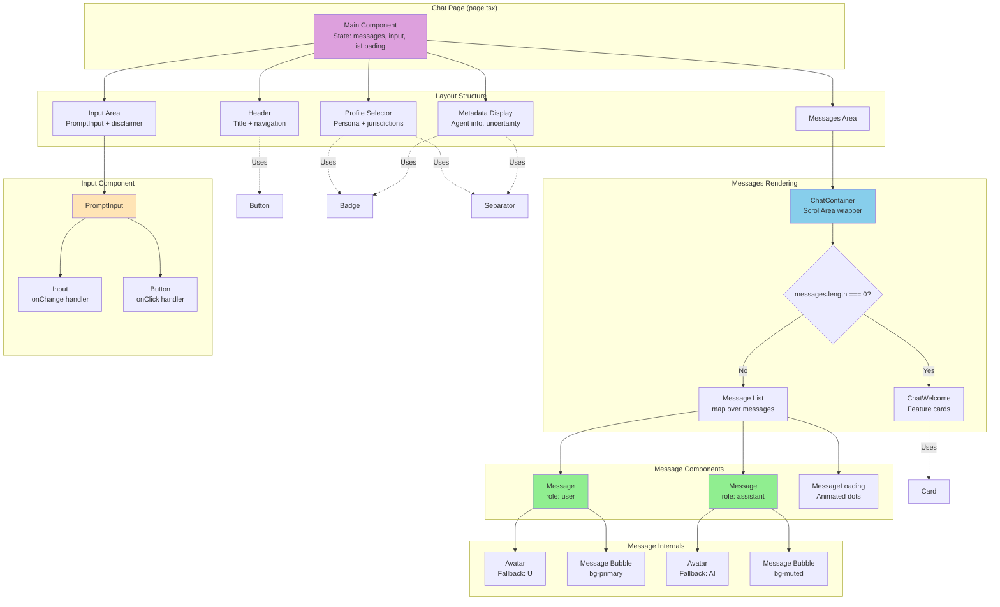
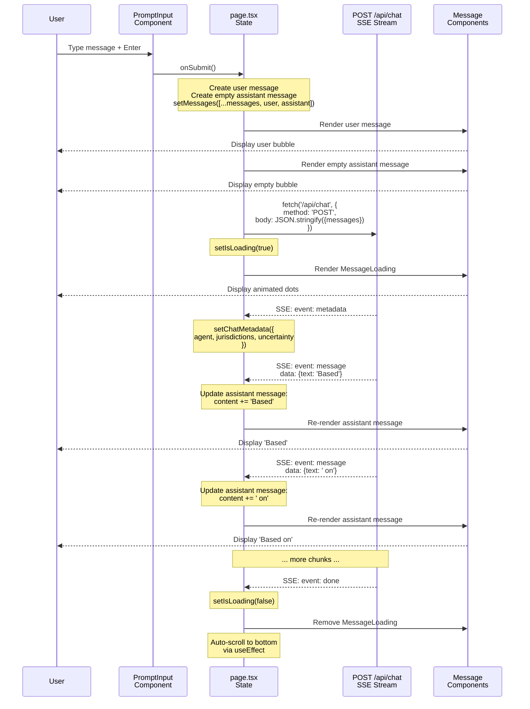
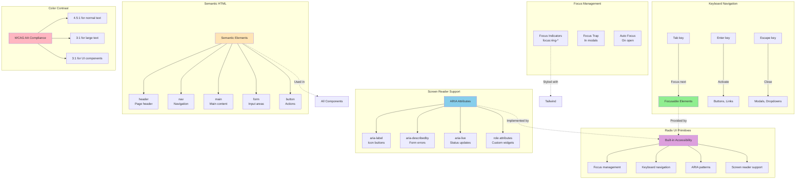

# Architecture Diagrams - v0.5

This document contains detailed Mermaid diagrams showing the v0.5 architecture flow, including the new clean layered UI architecture, LLM provider integration, and graph streaming.

## Table of Contents

1. [UI Layer Architecture](#ui-layer-architecture) *(New in v0.5)*
2. [Complete Request Flow](#complete-request-flow)
3. [LLM Provider Architecture](#llm-provider-architecture)
4. [Graph Streaming Architecture](#graph-streaming-architecture)

---

## UI Layer Architecture

*New in v0.5*

This diagram illustrates the clean layered architecture of the frontend UI, showing how Tailwind CSS v4, Radix UI, shadcn/ui, and custom chat components work together.

### Clean Layered UI Architecture

```mermaid
graph TB
    subgraph "Application Layer"
        Pages[Application Pages<br/>src/app/page.tsx, layout.tsx]
        Routes[API Routes<br/>src/app/api/*/route.ts]
    end

    subgraph "Feature Components Layer"
        ChatUI[Chat Components<br/>src/components/chat/]
        Message[Message<br/>Role-based bubbles, avatars]
        MessageLoading[MessageLoading<br/>Animated dots]
        ChatContainer[ChatContainer<br/>ScrollArea wrapper]
        PromptInput[PromptInput<br/>Input + submit button]

        ChatUI --> Message
        ChatUI --> MessageLoading
        ChatUI --> ChatContainer
        ChatUI --> PromptInput
    end

    subgraph "UI Components Layer"
        ShadcnUI[shadcn/ui Components<br/>src/components/ui/]
        Button[Button<br/>Variants: default, outline, ghost]
        Input[Input<br/>Text input with focus]
        Card[Card, CardHeader, CardContent]
        Badge[Badge<br/>Labels and tags]
        ScrollArea[ScrollArea<br/>Custom scrollbars]
        Avatar[Avatar, AvatarFallback]
        Separator[Separator<br/>Dividers]

        ShadcnUI --> Button
        ShadcnUI --> Input
        ShadcnUI --> Card
        ShadcnUI --> Badge
        ShadcnUI --> ScrollArea
        ShadcnUI --> Avatar
        ShadcnUI --> Separator
    end

    subgraph "Primitives Layer"
        RadixUI[Radix UI Primitives<br/>radix-ui/*]

        RadixSlot[radix-ui/react-slot<br/>Slot primitive]
        RadixScroll[radix-ui/react-scroll-area<br/>Scroll primitive]
        RadixAvatar[radix-ui/react-avatar<br/>Avatar primitive]
        RadixSeparator[radix-ui/react-separator<br/>Separator primitive]
        RadixLabel[radix-ui/react-label<br/>Label primitive]

        RadixUI --> RadixSlot
        RadixUI --> RadixScroll
        RadixUI --> RadixAvatar
        RadixUI --> RadixSeparator
        RadixUI --> RadixLabel
    end

    subgraph "Design System Layer"
        Tailwind[Tailwind CSS v4<br/>src/app/globals.css]

        Theme[theme blocks<br/>CSS variables]
        DarkMode[Dark mode<br/>.dark, media queries]
        Utilities[Utility classes<br/>bg-, text-, flex-]

        Tailwind --> Theme
        Tailwind --> DarkMode
        Tailwind --> Utilities
    end

    subgraph "Utilities"
        CN[cn() function<br/>src/lib/utils.ts]
        CVA[class-variance-authority<br/>Component variants]
        CLSX[clsx + tailwind-merge<br/>Class merging]

        CN --> CVA
        CN --> CLSX
    end

    %% Dependencies
    Pages -->|Composes| ChatUI
    Pages -->|Uses| ShadcnUI

    ChatUI -->|Built with| ShadcnUI
    Message -->|Uses| Avatar
    Message -->|Uses| Badge
    ChatContainer -->|Uses| ScrollArea
    PromptInput -->|Uses| Input
    PromptInput -->|Uses| Button

    ShadcnUI -->|Built on| RadixUI
    ShadcnUI -->|Styled with| Tailwind
    ShadcnUI -->|Uses| CN

    Button -->|Uses| RadixSlot
    ScrollArea -->|Uses| RadixScroll
    Avatar -->|Uses| RadixAvatar
    Separator -->|Uses| RadixSeparator

    RadixUI -->|Styled with| Tailwind

    Theme -.->|Provides tokens| ShadcnUI
    Theme -.->|Provides tokens| ChatUI

    style Pages fill:#DDA0DD
    style ChatUI fill:#87CEEB
    style ShadcnUI fill:#90EE90
    style RadixUI fill:#FFE4B5
    style Tailwind fill:#FFB6C1
    style CN fill:#F0E68C
```

### Component Hierarchy Example



### Tailwind v4 Theme System

```mermaid
graph LR
    subgraph "globals.css"
        Import[import tailwindcss]
    end

    subgraph "Light Mode Theme"
        LightTheme[theme block]

        LBG[--color-background: 0 0% 100%]
        LFG[--color-foreground: 240 10% 3.9%]
        LPrimary[--color-primary: 240 5.9% 10%]
        LRadius[--radius: 0.5rem]

        LightTheme --> LBG
        LightTheme --> LFG
        LightTheme --> LPrimary
        LightTheme --> LRadius
    end

    subgraph "Dark Mode Theme"
        DarkClass[.dark, data-theme='dark']
        DarkTheme[theme block]

        DBG[--color-background: 240 10% 3.9%]
        DFG[--color-foreground: 0 0% 98%]
        DPrimary[--color-primary: 0 0% 98%]

        DarkClass --> DarkTheme
        DarkTheme --> DBG
        DarkTheme --> DFG
        DarkTheme --> DPrimary
    end

    subgraph "Auto Dark Mode"
        MediaQuery[media prefers-color-scheme: dark]
        AutoDark[:root:not(.light)]
        AutoTheme[theme block]

        MediaQuery --> AutoDark
        AutoDark --> AutoTheme
        AutoTheme -.->|Same as| DarkTheme
    end

    subgraph "Usage in Components"
        ClassNames[className='bg-background<br/>text-foreground<br/>rounded-radius']
    end

    Import --> LightTheme
    Import --> DarkClass
    Import --> MediaQuery

    LightTheme -.->|Provides| ClassNames
    DarkTheme -.->|Overrides| ClassNames
    AutoTheme -.->|Overrides| ClassNames

    style Import fill:#FFB6C1
    style LightTheme fill:#F0E68C
    style DarkTheme fill:#4B0082,color:#fff
    style AutoTheme fill:#4B0082,color:#fff
    style ClassNames fill:#87CEEB
```

### Data Flow: User Input to UI Update



### Accessibility Flow



### Key UI Architecture Points

1. **Layered Approach**: Each layer has clear responsibilities and boundaries
2. **Composition Over Inheritance**: Build complex UIs from simple primitives
3. **Accessibility First**: Radix UI ensures WCAG compliance out of the box
4. **Theme System**: CSS variables enable runtime theming without rebuilds
5. **Type Safety**: Full TypeScript support from primitives to pages
6. **Future-Proof**: Easy migration path to official Vercel AI Elements

---

## Complete Request Flow

This diagram shows the complete flow of a chat request through the v0.4 architecture, including ComplianceEngine routing, agent execution, graph queries, and streaming responses.


### Key Architectural Points

1. **No Bypass**: Request flows through ComplianceEngine → Agent → Graph → LLM
2. **Graph Context**: Agent queries Memgraph before calling LLM
3. **Metadata First**: Client receives agent info and graph nodes before text
4. **Streaming**: LLM response streamed in real-time through all layers
5. **Prompt Aspects**: Jurisdiction-aware prompts built dynamically

---

## LLM Provider Architecture

This diagram shows how the LlmRouter integrates with Vercel AI SDK v5 and various providers, including the OpenAI Responses API.


### Provider Details

#### OpenAI Responses API vs Chat Completions


### Streaming Flow Through Layers


### Multi-Provider Routing


---

## Graph Streaming Architecture

This diagram shows the real-time graph streaming infrastructure for pushing incremental updates to clients.


### Graph Patch Format


### Change Detection Flow


---

## Technology Stack

### Core Dependencies


---

## Summary

These diagrams illustrate:

1. **Complete Request Flow**: End-to-end journey from user request through ComplianceEngine, agents, graph queries, and streaming LLM responses

2. **LLM Provider Architecture**: Multi-provider support via AI SDK v5, with automatic OpenAI Responses API detection and fallback

3. **Graph Streaming**: Real-time change detection and incremental patch delivery to clients

### Key Architectural Principles

- ✅ **Provider Agnostic**: Swap LLM providers via configuration
- ✅ **Graph First**: Rules live in Memgraph, LLMs explain them
- ✅ **Streaming Native**: Real-time responses for better UX
- ✅ **Type Safe**: TypeScript strict mode throughout
- ✅ **Privacy Focused**: Egress guards and local model routing
- ✅ **Separation of Concerns**: Clear layer boundaries enforced by ESLint
