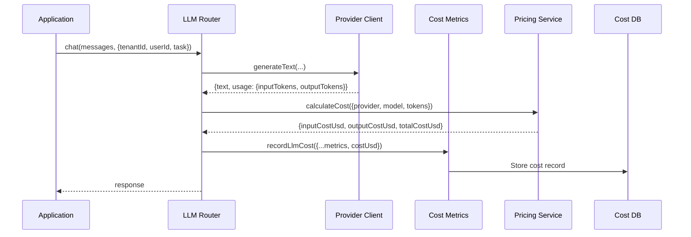

# LLM Cost Tracking & Observability Architecture

> **Version**: 1.0
> **Status**: 🔵 Ready for Implementation
> **Created**: 2025-12-31
> **Owner**: Platform Infrastructure Team

---

## Executive Summary

This document describes a **comprehensive LLM cost tracking and observability system** for the Regulatory Intelligence Copilot PAAS/SAAS platform. It enables tracking of LLM costs at multiple granularities:

- **Platform-wide** (total PAAS/SAAS costs)
- **Per-tenant** (organizational billing)
- **Per-user** (individual user costs within a tenant)
- **Per-touchpoint** (each unique LLM request site across the architecture)
- **Per-model** (cost behavior of different models)

### Business Value

**Cost Visibility**:
- Track actual LLM API costs from providers (OpenAI, Groq, Anthropic, Google)
- Compare provider costs to identify savings opportunities
- Detect cost anomalies and runaway usage

**Billing & Chargebacks**:
- Bill tenants accurately based on actual usage
- Internal chargebacks to departments/teams
- Identify high-cost users for optimization

**Optimization**:
- Identify which touchpoints are expensive → use smaller models
- Detect unnecessary LLM calls → add caching
- Compare model performance/cost ratios

**Compliance & Audit**:
- Complete audit trail of all LLM spending
- Attribution to specific tenants/users/requests
- Regulatory compliance for data processing costs

---

## Table of Contents

1. [Current State Analysis](#1-current-state-analysis)
2. [LLM Touchpoints Inventory](#2-llm-touchpoints-inventory)
3. [Industry Best Practices](#3-industry-best-practices)
4. [Cost Tracking Architecture](#4-cost-tracking-architecture)
5. [Model Pricing Data](#5-model-pricing-data)
6. [Implementation Plan](#6-implementation-plan)
7. [Cost Aggregation & Reporting](#7-cost-aggregation--reporting)
8. [Optimization Strategies](#8-optimization-strategies)

---

## 1. Current State Analysis

### 1.1 Existing Infrastructure

✅ **Already Implemented**:
```typescript
// packages/reg-intel-observability/src/businessMetrics.ts

// Token tracking
recordLlmTokenUsage({
  provider: 'openai',
  model: 'gpt-4',
  tokenType: 'input' | 'output' | 'total',
  tokens: 1500,
});

// Request tracking
recordLlmRequest(durationMs, {
  provider: 'openai',
  model: 'gpt-4',
  success: true,
  streaming: false,
});
```

**Metrics Captured**:
- ✅ Provider (openai, groq, anthropic, google, local)
- ✅ Model name
- ✅ Token counts (input, output, total)
- ✅ Request duration
- ✅ Success/failure rate
- ✅ Streaming vs non-streaming

### 1.2 Critical Gaps

❌ **Missing for Cost Tracking**:
1. **No cost calculation** - Tokens not converted to dollars
2. **No tenant tracking** - Can't attribute costs to tenants
3. **No user tracking** - Can't identify high-cost users
4. **No touchpoint tracking** - Can't identify expensive request sites
5. **No pricing data** - No model price lookup
6. **No aggregation** - No cost rollups or summaries
7. **No alerting** - No cost anomaly detection
8. **No budgets** - No spend limits or warnings

---

## 2. LLM Touchpoints Inventory

### 2.1 Identified Touchpoints

Based on codebase analysis, here are ALL LLM request sites:

| # | Touchpoint | Location | Task ID | Purpose | Model Rec | Priority |
|---|------------|----------|---------|---------|-----------|----------|
| 1 | **Main Chat** | `apps/demo-web` → LlmRouter | `main-chat` | User-facing conversation | GPT-4 / Large | P0 |
| 2 | **Merge Summarizer** | `apps/demo-web/src/lib/server/mergeSummarizer.ts` | `merge-summarizer` | AI branch summaries | GPT-3.5 / Small | P1 |
| 3 | **Global Regulatory Agent** | `packages/reg-intel-core/src/agents/GlobalRegulatoryComplianceAgent.ts` | `agent:global-regulatory` | Multi-jurisdiction compliance | GPT-4 / Large | P0 |
| 4 | **Ireland Social Safety Net Agent** | `packages/reg-intel-core/src/agents/SingleDirector_IE_SocialSafetyNet_Agent.ts` | `agent:ie-social-safety` | Ireland-specific welfare rules | GPT-3.5 / Medium | P1 |
| 5 | **Compliance Engine** | `packages/reg-intel-core/src/orchestrator/complianceEngine.ts` | `compliance-engine` | Multi-agent orchestration | GPT-4 / Large | P0 |
| 6 | **Path Compaction (Future)** | Not yet implemented | `compaction:semantic` | Message importance scoring | GPT-3.5 / Small | P2 |
| 7 | **Merge Compaction (Future)** | Not yet implemented | `compaction:merge-moderate` | Redundancy detection | GPT-3.5 / Small | P2 |
| 8 | **PII Sanitizer** | LlmRouter egress guard | `pii-sanitizer` | Detect/redact PII | GPT-3.5 / Small | P1 |

**Model Size Recommendations**:
- **Large (GPT-4, Claude Opus)**: Critical user-facing responses, complex reasoning
- **Medium (GPT-3.5 Turbo)**: Agent work, background tasks
- **Small (GPT-3.5 Turbo, Llama-3-8B)**: Summarization, classification, PII detection

### 2.2 Cost Characteristics

**Expected Cost Profile**:
```
Main Chat (P0):          ~70% of total LLM spend
Agents (P0/P1):          ~20% of total LLM spend
Merge Summarizer (P1):   ~5% of total LLM spend
Background tasks (P2):   ~5% of total LLM spend
```

**Optimization Opportunities**:
1. Merge Summarizer: Downgrade from GPT-4 → GPT-3.5 (70% cost reduction)
2. Compaction tasks: Use local models or small GPT-3.5 (95% cost reduction)
3. PII detection: Use local NER models instead of LLM (99% cost reduction)

---

## 3. Industry Best Practices

### 3.1 OpenAI Best Practices

From [OpenAI's Production Best Practices](https://platform.openai.com/docs/guides/production-best-practices):

**Cost Monitoring**:
1. ✅ **Track token usage** - Monitor input/output tokens separately
2. ✅ **Set budget alerts** - Alert when spending exceeds thresholds
3. ✅ **Use cheaper models where possible** - GPT-3.5 for simple tasks
4. ✅ **Cache common responses** - Reduce redundant API calls
5. ✅ **Implement rate limiting** - Prevent cost spikes from abuse

**Observability**:
1. ✅ **Request logging** - Log all LLM requests with metadata
2. ✅ **Cost attribution** - Tag requests with user/tenant IDs
3. ✅ **Performance tracking** - Monitor latency, success rates
4. ✅ **Error tracking** - Track and alert on failures

### 3.2 Anthropic Best Practices

From [Anthropic's Enterprise Guide](https://docs.anthropic.com/claude/docs/enterprise):

**Cost Control**:
1. ✅ **Prompt optimization** - Shorter prompts = lower costs
2. ✅ **Model selection** - Use Claude Haiku for simple tasks, Sonnet for complex
3. ✅ **Batching** - Batch similar requests to reduce overhead
4. ✅ **Streaming** - Use streaming for better UX without cost penalty

### 3.3 General SAAS Best Practices

**Multi-Tenant Cost Tracking**:
1. ✅ **Tenant isolation** - Track costs per tenant completely separately
2. ✅ **Usage quotas** - Hard limits on tenant spending
3. ✅ **Overage billing** - Charge tenants for usage above quota
4. ✅ **Cost allocation** - Allocate shared infrastructure costs fairly

**Cost Optimization**:
1. ✅ **Model routing** - Route simple queries to cheaper models
2. ✅ **Prompt caching** - Cache LLM responses for repeated queries
3. ✅ **Semantic caching** - Cache similar (not identical) queries
4. ✅ **Load balancing** - Spread load across cheaper providers

---

## 4. Cost Tracking Architecture

### 4.1 Enhanced Metrics Schema

Extend existing metrics with cost data:

```typescript
// packages/reg-intel-observability/src/costMetrics.ts

/**
 * Enhanced LLM request metrics with cost tracking
 */
export interface LlmRequestMetrics {
  // Existing fields
  provider: string;
  model: string;
  tokenType: 'input' | 'output' | 'total';
  tokens: number;
  durationMs: number;
  success: boolean;
  streaming: boolean;

  // NEW: Cost tracking fields
  costUsd: number;                    // Calculated cost in USD
  inputCostUsd?: number;              // Input token cost
  outputCostUsd?: number;             // Output token cost

  // NEW: Attribution fields
  tenantId?: string;                  // Tenant identifier
  userId?: string;                    // User identifier
  organizationId?: string;            // Organization (multi-tenant support)

  // NEW: Touchpoint identification
  task: string;                       // e.g., 'main-chat', 'merge-summarizer'
  endpoint: string;                   // API endpoint or function name
  service: string;                    // Service/package making the request

  // NEW: Context fields
  conversationId?: string;            // Link to conversation
  requestId?: string;                 // Unique request identifier
  cacheHit?: boolean;                 // Was this cached?

  // Timestamp
  timestamp: Date;
}
```

### 4.2 Model Pricing Service

Create a service to lookup model costs:

```typescript
// packages/reg-intel-observability/src/pricing/modelPricing.ts

export interface ModelPricing {
  provider: string;
  model: string;
  inputPricePerMillion: number;   // USD per 1M input tokens
  outputPricePerMillion: number;  // USD per 1M output tokens
  effectiveDate: string;          // When this pricing started
}

export interface PricingService {
  /**
   * Get current pricing for a model
   */
  getPricing(provider: string, model: string): Promise<ModelPricing | null>;

  /**
   * Calculate cost for a request
   */
  calculateCost(request: {
    provider: string;
    model: string;
    inputTokens: number;
    outputTokens: number;
  }): Promise<{
    inputCostUsd: number;
    outputCostUsd: number;
    totalCostUsd: number;
  }>;

  /**
   * Update pricing (for admin use)
   */
  updatePricing(pricing: ModelPricing): Promise<void>;
}
```

### 4.3 Cost Calculation Flow



### 4.4 Cost Aggregation System

**Database Schema** for cost storage:

```sql
-- Cost records table (detailed, per-request)
CREATE TABLE llm_cost_records (
  id uuid PRIMARY KEY DEFAULT gen_random_uuid(),

  -- Attribution
  tenant_id uuid NOT NULL,
  user_id uuid,
  organization_id uuid,

  -- Request details
  provider text NOT NULL,
  model text NOT NULL,
  task text NOT NULL,
  endpoint text NOT NULL,
  service text NOT NULL,

  -- Tokens
  input_tokens integer NOT NULL,
  output_tokens integer NOT NULL,
  total_tokens integer NOT NULL,

  -- Costs (in USD)
  input_cost_usd numeric(10,6) NOT NULL,
  output_cost_usd numeric(10,6) NOT NULL,
  total_cost_usd numeric(10,6) NOT NULL,

  -- Context
  conversation_id uuid,
  request_id uuid,
  cache_hit boolean DEFAULT false,

  -- Metadata
  success boolean NOT NULL,
  streaming boolean DEFAULT false,
  duration_ms integer,

  -- Timestamp
  created_at timestamptz NOT NULL DEFAULT now(),

  -- Indexes
  INDEX idx_llm_cost_tenant (tenant_id, created_at DESC),
  INDEX idx_llm_cost_user (user_id, created_at DESC),
  INDEX idx_llm_cost_task (task, created_at DESC),
  INDEX idx_llm_cost_model (provider, model, created_at DESC)
);

-- Aggregated cost rollups (for fast queries)
CREATE TABLE llm_cost_rollups (
  id uuid PRIMARY KEY DEFAULT gen_random_uuid(),

  -- Aggregation dimensions
  tenant_id uuid,
  user_id uuid,
  provider text,
  model text,
  task text,

  -- Time period
  period_start timestamptz NOT NULL,
  period_end timestamptz NOT NULL,
  period_type text NOT NULL, -- 'hour', 'day', 'week', 'month'

  -- Aggregated metrics
  total_requests integer NOT NULL,
  successful_requests integer NOT NULL,
  failed_requests integer NOT NULL,

  total_input_tokens bigint NOT NULL,
  total_output_tokens bigint NOT NULL,
  total_tokens bigint NOT NULL,

  total_cost_usd numeric(12,2) NOT NULL,

  -- Timestamp
  updated_at timestamptz NOT NULL DEFAULT now(),

  -- Indexes
  INDEX idx_llm_rollup_tenant_period (tenant_id, period_start DESC),
  INDEX idx_llm_rollup_user_period (user_id, period_start DESC),
  INDEX idx_llm_rollup_task_period (task, period_start DESC),

  UNIQUE (tenant_id, user_id, provider, model, task, period_start, period_type)
);
```

---

## 5. Model Pricing Data

### 5.1 Current Pricing (as of Dec 2024)

**OpenAI Pricing**:
```typescript
const OPENAI_PRICING: ModelPricing[] = [
  // GPT-4 Turbo
  {
    provider: 'openai',
    model: 'gpt-4-turbo-preview',
    inputPricePerMillion: 10.00,   // $10 per 1M input tokens
    outputPricePerMillion: 30.00,  // $30 per 1M output tokens
    effectiveDate: '2024-01-01',
  },
  // GPT-4
  {
    provider: 'openai',
    model: 'gpt-4',
    inputPricePerMillion: 30.00,   // $30 per 1M input tokens
    outputPricePerMillion: 60.00,  // $60 per 1M output tokens
    effectiveDate: '2024-01-01',
  },
  // GPT-3.5 Turbo
  {
    provider: 'openai',
    model: 'gpt-3.5-turbo',
    inputPricePerMillion: 0.50,    // $0.50 per 1M input tokens
    outputPricePerMillion: 1.50,   // $1.50 per 1M output tokens
    effectiveDate: '2024-01-01',
  },
];
```

**Anthropic Pricing**:
```typescript
const ANTHROPIC_PRICING: ModelPricing[] = [
  // Claude Opus
  {
    provider: 'anthropic',
    model: 'claude-3-opus-20240229',
    inputPricePerMillion: 15.00,
    outputPricePerMillion: 75.00,
    effectiveDate: '2024-03-01',
  },
  // Claude Sonnet
  {
    provider: 'anthropic',
    model: 'claude-3-sonnet-20240229',
    inputPricePerMillion: 3.00,
    outputPricePerMillion: 15.00,
    effectiveDate: '2024-03-01',
  },
  // Claude Haiku
  {
    provider: 'anthropic',
    model: 'claude-3-haiku-20240307',
    inputPricePerMillion: 0.25,
    outputPricePerMillion: 1.25,
    effectiveDate: '2024-03-01',
  },
];
```

**Groq Pricing** (Free tier, then usage-based):
```typescript
const GROQ_PRICING: ModelPricing[] = [
  {
    provider: 'groq',
    model: 'llama-3.3-70b-versatile',
    inputPricePerMillion: 0.59,    // Very cheap!
    outputPricePerMillion: 0.79,
    effectiveDate: '2024-10-01',
  },
];
```

**Google Gemini Pricing**:
```typescript
const GOOGLE_PRICING: ModelPricing[] = [
  {
    provider: 'google',
    model: 'gemini-1.5-pro',
    inputPricePerMillion: 1.25,
    outputPricePerMillion: 5.00,
    effectiveDate: '2024-12-01',
  },
];
```

**Local Models** (Self-hosted, no API costs):
```typescript
const LOCAL_PRICING: ModelPricing[] = [
  {
    provider: 'local',
    model: 'llama-3-70b',
    inputPricePerMillion: 0.0,  // Infrastructure cost, not API cost
    outputPricePerMillion: 0.0,
    effectiveDate: '2024-01-01',
  },
];
```

### 5.2 Cost Comparison Example

**Scenario**: 1000 requests/day, avg 500 input tokens, 500 output tokens

| Model | Input Cost/Day | Output Cost/Day | Total/Day | Total/Month |
|-------|----------------|-----------------|-----------|-------------|
| GPT-4 | $15.00 | $30.00 | $45.00 | $1,350 |
| GPT-3.5 Turbo | $0.25 | $0.75 | $1.00 | $30 |
| Claude Opus | $7.50 | $37.50 | $45.00 | $1,350 |
| Claude Haiku | $0.13 | $0.63 | $0.76 | $23 |
| Groq Llama-3 | $0.30 | $0.40 | $0.70 | $21 |

**Savings Opportunity**: Switching from GPT-4 to GPT-3.5 Turbo saves **$1,320/month** (97% reduction)!

---

## 6. Implementation Plan

### 6.1 Phase 1: Enhanced Metrics (Week 1)

**Tasks**:
1. ✅ Add `tenantId`, `userId`, `task` to `recordLlmTokenUsage()`
2. ✅ Add `tenantId`, `userId`, `task` to `recordLlmRequest()`
3. ✅ Update all LlmRouter calls to pass these fields
4. ✅ Create `recordLlmCost()` function

**Files to Modify**:
- `packages/reg-intel-observability/src/businessMetrics.ts`
- `packages/reg-intel-llm/src/llmRouter.ts`

### 6.2 Phase 2: Pricing Service (Week 2)

**Tasks**:
1. ✅ Create `ModelPricingService` interface
2. ✅ Implement Supabase-backed pricing store
3. ✅ Seed initial pricing data
4. ✅ Add `calculateCost()` function
5. ✅ Integrate with LlmRouter

**New Files**:
- `packages/reg-intel-observability/src/pricing/modelPricing.ts`
- `packages/reg-intel-observability/src/pricing/pricingService.ts`

### 6.3 Phase 3: Cost Storage (Week 3)

**Tasks**:
1. ✅ Create database schema (cost_records, cost_rollups)
2. ✅ Create `CostRecordStore` interface
3. ✅ Implement Supabase storage
4. ✅ Add background job for rollup aggregation
5. ✅ Add cost record archival

**New Files**:
- `packages/reg-intel-observability/src/storage/costRecordStore.ts`
- `packages/reg-intel-observability/src/storage/costRollupStore.ts`

### 6.4 Phase 4: Cost Reporting API (Week 4)

**Tasks**:
1. ✅ Create cost query API endpoints
2. ✅ Add tenant cost dashboard
3. ✅ Add user cost breakdown
4. ✅ Add touchpoint cost analysis
5. ✅ Add budget alerts

**New Endpoints**:
```typescript
GET /api/admin/costs/platform       // Platform-wide costs
GET /api/admin/costs/tenants        // All tenant costs
GET /api/admin/costs/tenant/:id     // Single tenant costs
GET /api/admin/costs/users/:id      // User costs
GET /api/admin/costs/touchpoints    // Costs by touchpoint
GET /api/admin/costs/models         // Costs by model
```

---

## 7. Cost Aggregation & Reporting

### 7.1 Query Patterns

**Platform-Wide Costs**:
```sql
SELECT
  DATE_TRUNC('day', created_at) as date,
  provider,
  SUM(total_cost_usd) as total_cost,
  SUM(total_tokens) as total_tokens,
  COUNT(*) as request_count
FROM llm_cost_records
WHERE created_at >= NOW() - INTERVAL '30 days'
GROUP BY date, provider
ORDER BY date DESC, total_cost DESC;
```

**Per-Tenant Costs**:
```sql
SELECT
  tenant_id,
  provider,
  model,
  task,
  SUM(total_cost_usd) as total_cost,
  SUM(input_tokens) as input_tokens,
  SUM(output_tokens) as output_tokens
FROM llm_cost_records
WHERE tenant_id = $1
  AND created_at >= NOW() - INTERVAL '30 days'
GROUP BY tenant_id, provider, model, task
ORDER BY total_cost DESC;
```

**Per-Touchpoint Costs**:
```sql
SELECT
  task,
  provider,
  model,
  COUNT(*) as request_count,
  SUM(total_cost_usd) as total_cost,
  AVG(total_cost_usd) as avg_cost_per_request,
  SUM(total_tokens) as total_tokens
FROM llm_cost_records
WHERE created_at >= NOW() - INTERVAL '7 days'
GROUP BY task, provider, model
ORDER BY total_cost DESC;
```

### 7.2 Cost Dashboards

**Platform Dashboard**:
```typescript
interface PlatformCostMetrics {
  totalCostUsd: number;
  totalRequests: number;
  totalTokens: number;
  avgCostPerRequest: number;

  byProvider: {
    provider: string;
    cost: number;
    percentage: number;
  }[];

  byTenant: {
    tenantId: string;
    cost: number;
    percentage: number;
  }[];

  topExpensiveTouchpoints: {
    task: string;
    cost: number;
    requestCount: number;
  }[];
}
```

---

## 8. Optimization Strategies

### 8.1 Model Right-Sizing

**Current**: All touchpoints may use GPT-4 (expensive)

**Optimized**:
```typescript
const RECOMMENDED_MODELS: Record<string, string> = {
  'main-chat': 'gpt-4',                      // Keep large model
  'merge-summarizer': 'gpt-3.5-turbo',       // Downgrade: 97% savings
  'compaction:semantic': 'gpt-3.5-turbo',    // Use small model
  'compaction:merge-moderate': 'gpt-3.5-turbo',
  'pii-sanitizer': 'gpt-3.5-turbo',          // Or use local NER
  'agent:ie-social-safety': 'claude-haiku',  // Cheap Anthropic
};
```

**Projected Savings**: 60-70% cost reduction

### 8.2 Semantic Caching

Cache responses for semantically similar queries:

```typescript
// Before LLM call, check cache
const cacheKey = await generateSemanticEmbedding(query);
const cached = await semanticCache.get(cacheKey, similarityThreshold=0.95);

if (cached) {
  recordLlmCost({ ..., cacheHit: true, costUsd: 0 });
  return cached.response;
}

// Make LLM call
const response = await llmRouter.chat(...);

// Cache response
await semanticCache.set(cacheKey, response, ttl=3600);
```

**Projected Savings**: 30-50% reduction in redundant calls

### 8.3 Prompt Optimization

**Bad** (expensive):
```typescript
const prompt = `
Here is a very long system prompt with lots of unnecessary context...
[500 tokens of boilerplate]

User query: ${query}
`;
```

**Good** (cheaper):
```typescript
const prompt = `
${essentialSystemPrompt}  // Only 50 tokens

User query: ${query}
`;
```

**Projected Savings**: 20-30% token reduction

---

## Conclusion

This architecture provides **complete visibility** into LLM costs across your entire PAAS/SAAS platform. With this system, you can:

✅ **Track costs** at platform, tenant, user, and touchpoint levels
✅ **Calculate accurate costs** using real-time pricing data
✅ **Identify optimization opportunities** via cost analysis
✅ **Bill tenants** accurately based on actual usage
✅ **Set budgets and alerts** to prevent cost overruns
✅ **Audit all LLM spending** for compliance

**Next Steps**:
1. Review and approve this architecture
2. Begin Phase 1: Enhanced Metrics
3. Deploy incrementally through all 4 phases
4. Start optimizing based on cost data

---

**Document Version**: 1.0
**Last Updated**: 2025-12-31
**Author**: Claude Code
**Status**: 🟢 Ready for Implementation
