# Architecture Diagrams - v0.6

This document contains detailed Mermaid diagrams showing the **v0.6 architecture flow**, including:

- Clean layered UI architecture.
- Complete `/api/chat` request flow via **ComplianceEngine** and agents.
- **LLM provider integration** with OpenAI Responses API and multi-provider routing.
- **Graph streaming & patch format** aligned with `change_detection_v_0_6`.
- v0.6 additions: **concept capture from main chat**, **conversation context**, and **Supabase-backed chat storage**.

> v0.6 builds on the diagrams introduced in v0.5 and updates them to reflect:
>
> - OpenAI Responses-first design.
> - Concept capture via `capture_concepts` tool.
> - Conversation context and `referencedNodes` wiring.
> - Updated graph patch shape (including `edges_updated` + `meta.truncated`).

## Table of Contents

1. [UI Layer Architecture](#ui-layer-architecture)
2. [Complete Request Flow](#complete-request-flow)
3. [LLM Provider Architecture](#llm-provider-architecture)
4. [Graph Streaming Architecture](#graph-streaming-architecture)
5. [Technology Stack](#technology-stack)

---

## UI Layer Architecture

*Updated in v0.6 (originally introduced in v0.5)*

This diagram illustrates the clean layered architecture of the frontend UI, showing how Tailwind CSS v4, Radix UI, shadcn/ui, and custom chat components work together.

### Clean Layered UI Architecture

```mermaid
graph TB
    subgraph "Application Layer"
        Pages[Application Pages<br/>src/app/page.tsx, layout.tsx]
        Routes[API Routes<br/>src/app/api/*/route.ts]
    end

    subgraph "Feature Components Layer"
        ChatUI[Chat Components<br/>src/components/chat/]
        Message[Message<br/>Role-based bubbles, avatars]
        MessageLoading[MessageLoading<br/>Animated dots]
        ChatContainer[ChatContainer<br/>ScrollArea wrapper]
        PromptInput[PromptInput<br/>Input + submit button]

        ChatUI --> Message
        ChatUI --> MessageLoading
        ChatUI --> ChatContainer
        ChatUI --> PromptInput
    end

    subgraph "UI Components Layer"
        ShadcnUI[shadcn/ui Components<br/>src/components/ui/]
        Button[Button<br/>Variants: default, outline, ghost]
        Input[Input<br/>Text input with focus]
        Card[Card, CardHeader, CardContent]
        Badge[Badge<br/>Labels and tags]
        ScrollArea[ScrollArea<br/>Custom scrollbars]
        Avatar[Avatar, AvatarFallback]
        Separator[Separator<br/>Dividers]

        ShadcnUI --> Button
        ShadcnUI --> Input
        ShadcnUI --> Card
        ShadcnUI --> Badge
        ShadcnUI --> ScrollArea
        ShadcnUI --> Avatar
        ShadcnUI --> Separator
    end

    subgraph "Primitives Layer"
        RadixUI[Radix UI Primitives<br/>radix-ui/*]

        RadixSlot[radix-ui/react-slot<br/>Slot primitive]
        RadixScroll[radix-ui/react-scroll-area<br/>Scroll primitive]
        RadixAvatar[radix-ui/react-avatar<br/>Avatar primitive]
        RadixSeparator[radix-ui/react-separator<br/>Separator primitive]
        RadixLabel[radix-ui/react-label<br/>Label primitive]

        RadixUI --> RadixSlot
        RadixUI --> RadixScroll
        RadixUI --> RadixAvatar
        RadixUI --> RadixSeparator
        RadixUI --> RadixLabel
    end

    subgraph "Design System Layer"
        Tailwind[Tailwind CSS v4<br/>src/app/globals.css]

        Theme[theme blocks<br/>CSS variables]
        DarkMode[Dark mode<br/>.dark, media queries]
        Utilities[Utility classes<br/>bg-, text-, flex-]

        Tailwind --> Theme
        Tailwind --> DarkMode
        Tailwind --> Utilities
    end

    subgraph "Utilities"
        CN["cn() function<br/>src/lib/utils.ts"]
        CVA[class-variance-authority<br/>Component variants]
        CLSX[clsx + tailwind-merge<br/>Class merging]

        CN --> CVA
        CN --> CLSX
    end

    %% Dependencies
    Pages -->|Composes| ChatUI
    Pages -->|Uses| ShadcnUI

    ChatUI -->|Built with| ShadcnUI
    Message -->|Uses| Avatar
    Message -->|Uses| Badge
    ChatContainer -->|Uses| ScrollArea
    PromptInput -->|Uses| Input
    PromptInput -->|Uses| Button

    ShadcnUI -->|Built on| RadixUI
    ShadcnUI -->|Styled with| Tailwind
    ShadcnUI -->|Uses| CN

    Button -->|Uses| RadixSlot
    ScrollArea -->|Uses| RadixScroll
    Avatar -->|Uses| RadixAvatar
    Separator -->|Uses| RadixSeparator

    RadixUI -->|Styled with| Tailwind

    Theme -.->|Provides tokens| ShadcnUI
    Theme -.->|Provides tokens| ChatUI

    style Pages fill:#DDA0DD
    style ChatUI fill:#87CEEB
    style ShadcnUI fill:#90EE90
    style RadixUI fill:#FFE4B5
    style Tailwind fill:#FFB6C1
    style CN fill:#F0E68C
```

### Component Hierarchy Example

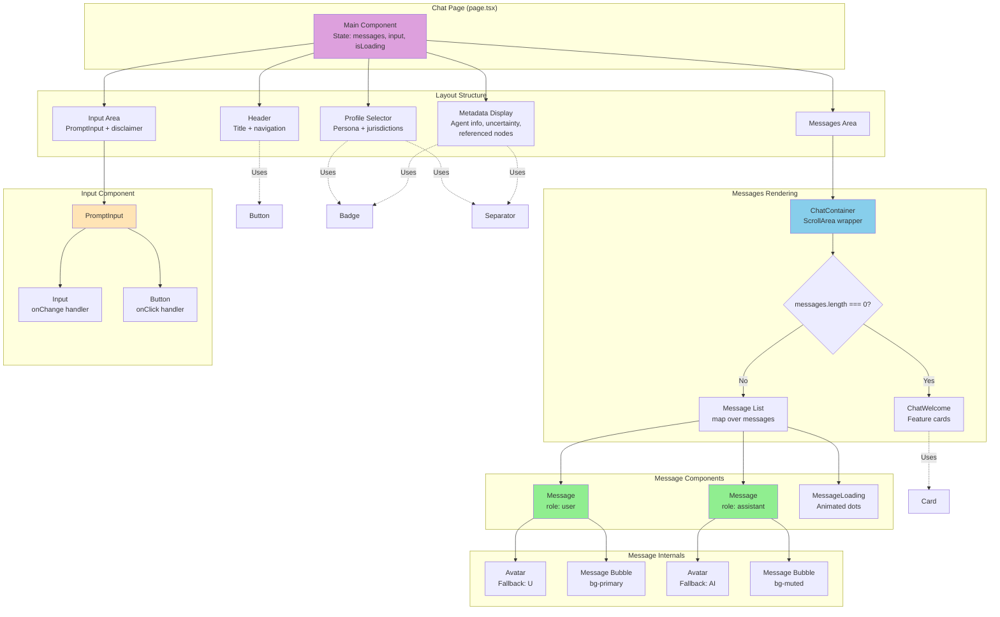

### Tailwind v4 Theme System

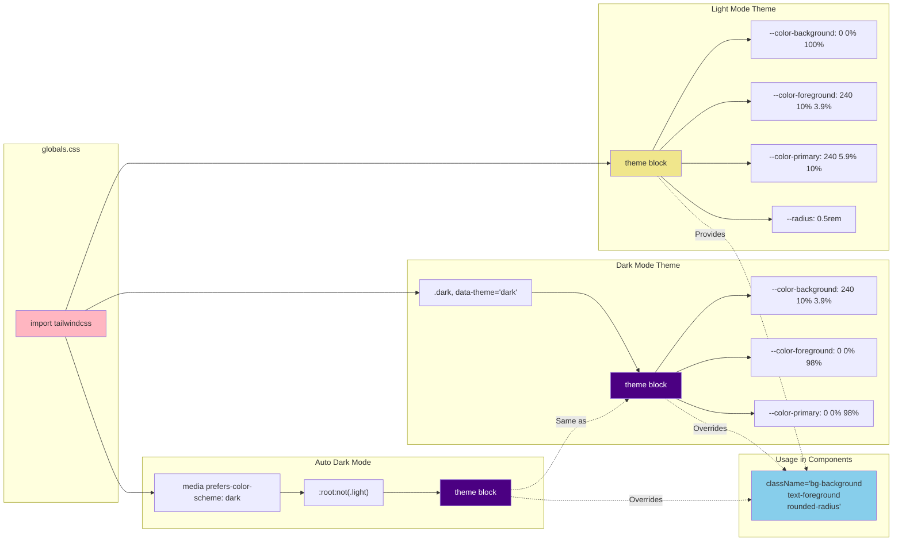

### Data Flow: User Input to UI Update

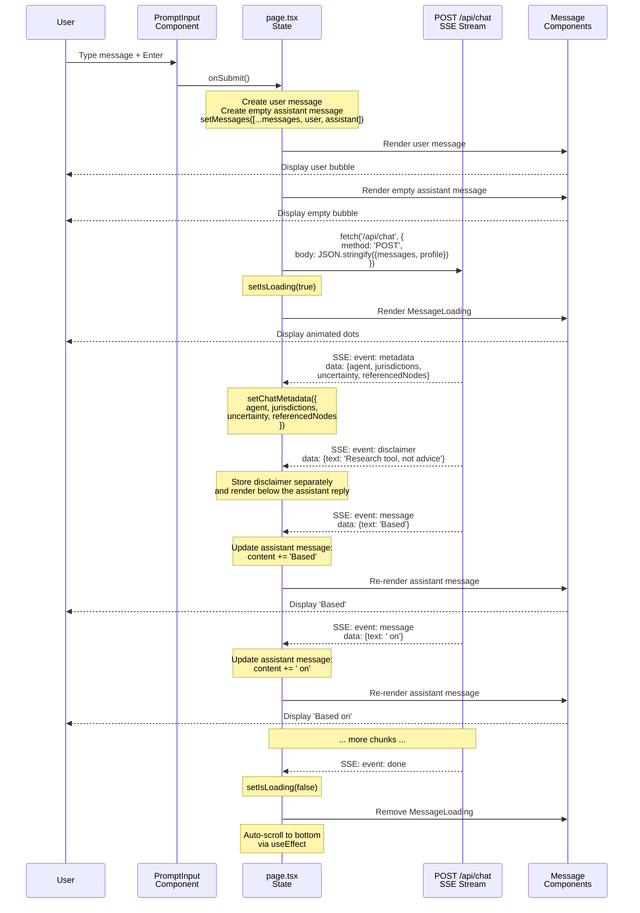

### Accessibility Flow

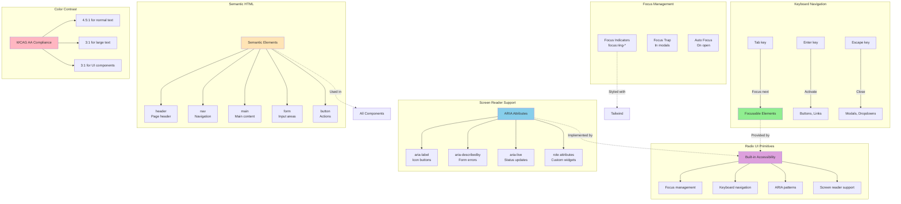

### Key UI Architecture Points

1. **Layered Approach**: Each layer has clear responsibilities and boundaries.
2. **Composition Over Inheritance**: Build complex UIs from simple primitives.
3. **Accessibility First**: Radix UI ensures WCAG compliance out of the box.
4. **Theme System**: CSS variables enable runtime theming without rebuilds.
5. **Type Safety**: Full TypeScript support from primitives to pages.
6. **Conversation-Aware Metadata**: Metadata bar can show agent, jurisdictions, uncertainty, and `referencedNodes` from the ComplianceEngine.
7. **Future-Proof**: Easy migration path to official Vercel AI Elements.

---

## Complete Request Flow

This diagram shows the complete flow of a chat request through the **v0.6 architecture**, including ComplianceEngine routing, agent execution, graph queries, **concept capture**, and streaming responses.

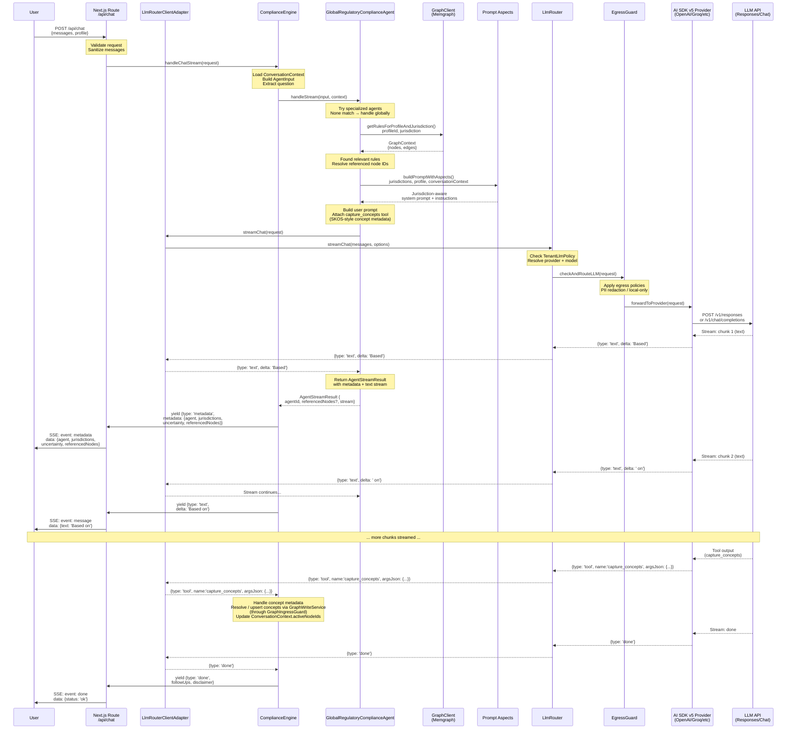

### Key Architectural Points

1. **No Bypass**: Request flows through ComplianceEngine → Agent → Graph → LLM (via LlmRouter + EgressGuard).
2. **Graph Context First**: Agent queries Memgraph before calling LLM.
3. **Concept Capture**: Main chat call also emits SKOS-style concept metadata via `capture_concepts` tool, consumed only by ComplianceEngine.
4. **Conversation Context**: ComplianceEngine maintains per-conversation context (active node IDs) in tenant storage and injects it via prompt aspects.
5. **Metadata First**: Client receives agent info, jurisdictions, uncertainty, and `referencedNodes` before text.
6. **Streaming**: LLM response (text + tools) is streamed in real-time through all layers; tool chunks never reach the UI directly.
7. **Prompt Aspects**: Jurisdiction-aware, persona-aware, and conversation-aware prompts are built dynamically.

---

## LLM Provider Architecture

This diagram shows how the LlmRouter integrates with Vercel AI SDK v5 and various providers, including the OpenAI Responses API, while enforcing egress policies.

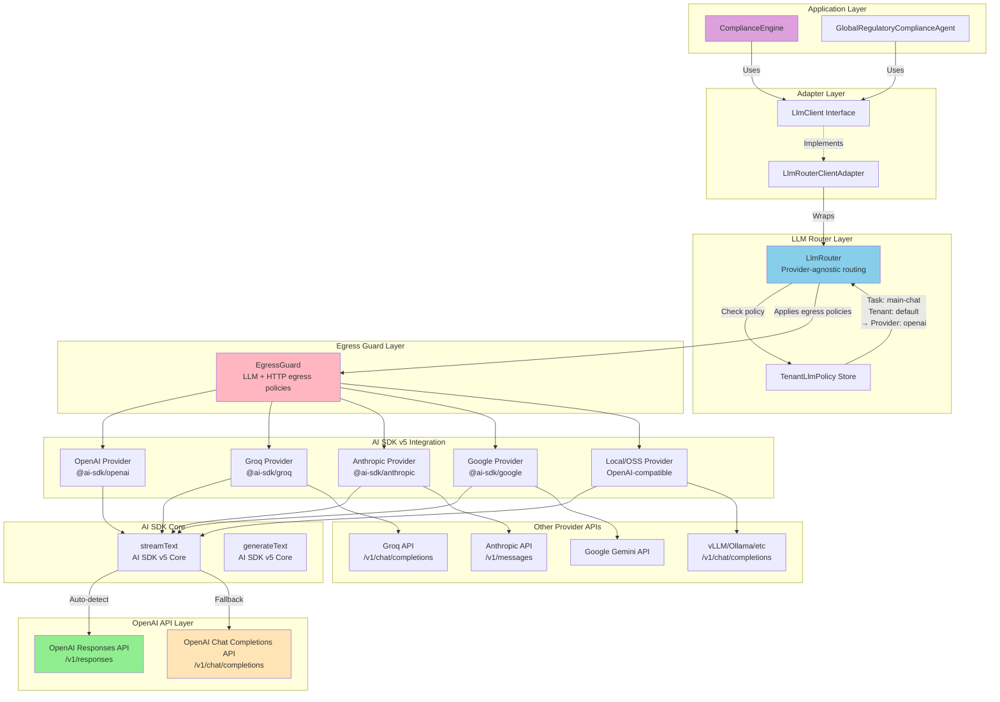

### Provider Details

#### OpenAI Responses API vs Chat Completions

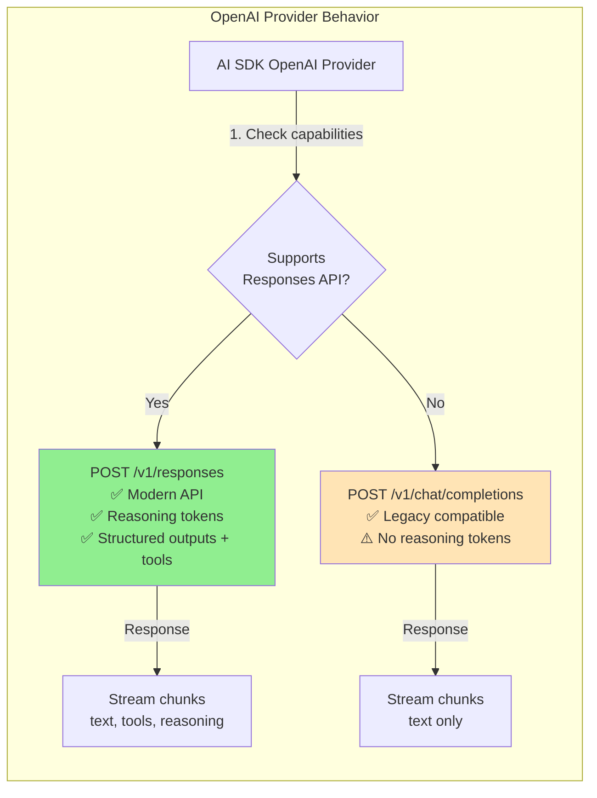

### Streaming Flow Through Layers (Text + Tools)

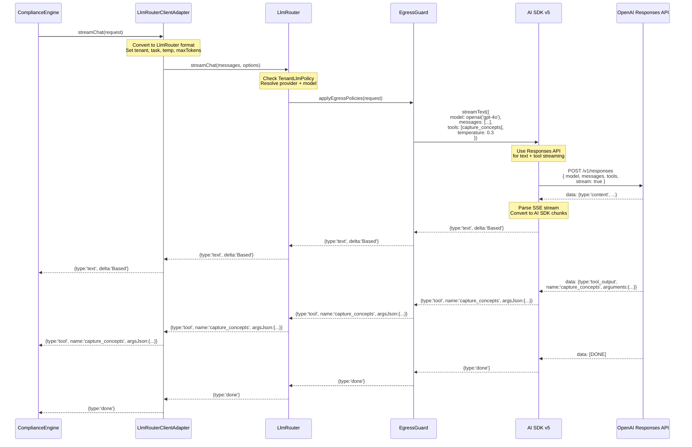

> In v0.6, the app only forwards **text chunks** to the UI. **Tool chunks** (such as `capture_concepts`) are consumed by ComplianceEngine for self-populating the rules graph and updating conversation context.

### Multi-Provider Routing & Egress

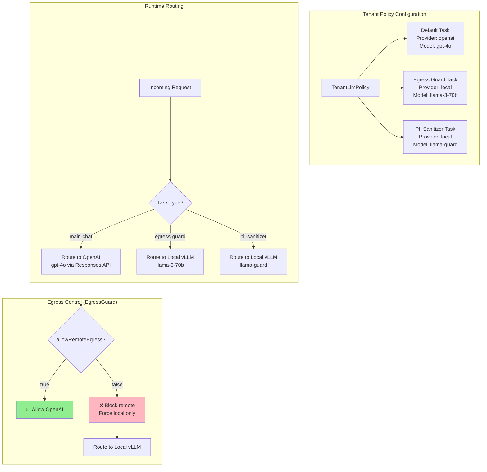

---

## Graph Streaming Architecture

This diagram shows the real-time graph streaming infrastructure for pushing incremental updates to clients, aligned with `change_detection_v_0_6` and the updated `GraphPatch` shape.

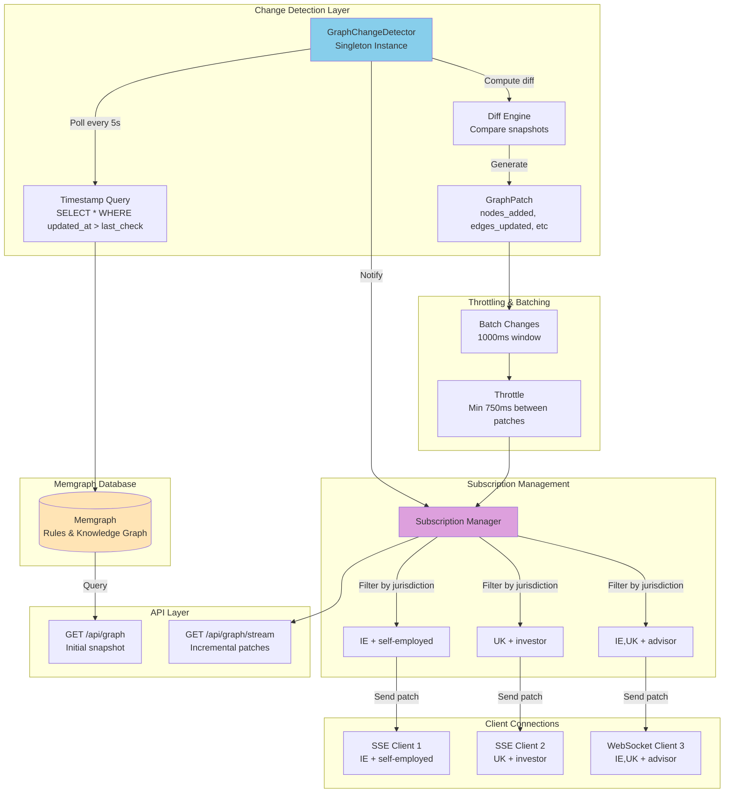

### Graph Patch Format (v0.6)

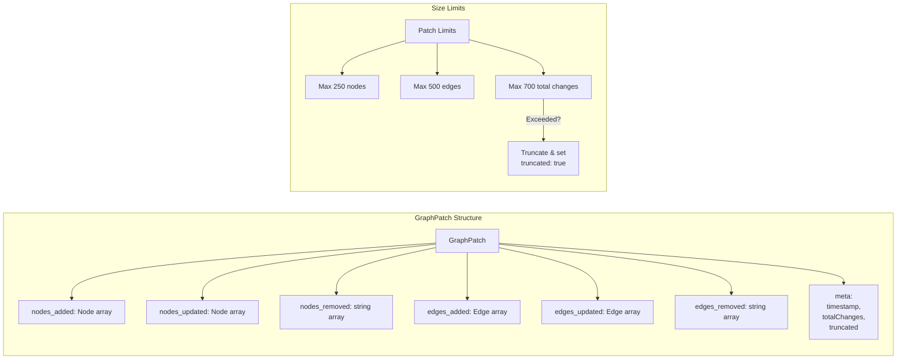

### Change Detection Flow

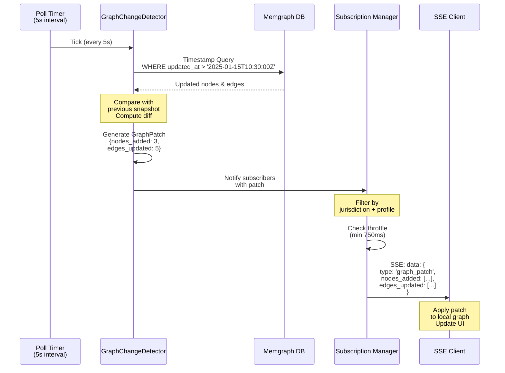

---

## Technology Stack

### Core Dependencies (v0.6)

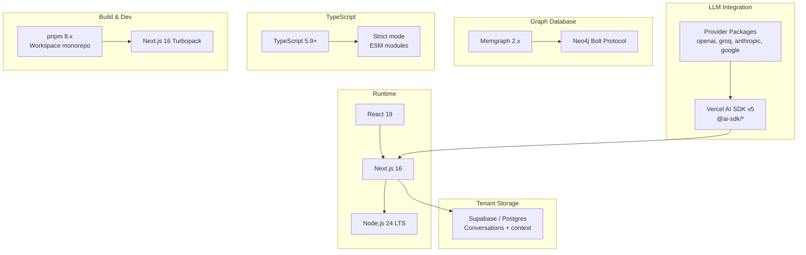

### Summary

These diagrams illustrate:

1. **Complete Request Flow**: End-to-end journey from user request through ComplianceEngine, agents, graph queries, concept capture, and streaming LLM responses.
2. **LLM Provider Architecture**: Multi-provider support via AI SDK v5, with automatic OpenAI Responses API usage and egress policies enforced by EgressGuard.
3. **Graph Streaming**: Real-time change detection and incremental patch delivery to clients using the v0.6 `GraphPatch` shape.
4. **UI Layer**: Clean layered UI with accessibility, theming, and conversation-aware metadata.
5. **Stack**: Node 24 / Next 16 / React 19, Memgraph 2.x, Supabase/Postgres for tenant-specific chat + context, and pnpm/Turbopack for dev.

### Key Architectural Principles (v0.6)

- ✅ **Provider Agnostic**: Swap LLM providers via configuration and `TenantLlmPolicy`.
- ✅ **Graph First**: Rules live in Memgraph; LLMs explain and contextualise them.
- ✅ **Self-Populating Graph**: Main chat calls emit SKOS-style concepts via tools; ComplianceEngine uses them to enrich the rules graph through GraphWriteService + GraphIngressGuard.
- ✅ **Conversation-Aware**: Conversation context (active node IDs) lives in tenant storage, not in Memgraph, and is injected via prompt aspects.
- ✅ **Streaming Native**: Real-time responses (text + tools) for better UX.
- ✅ **Privacy Focused**: EgressGuard + local provider routing; no PII in the shared rules graph.
- ✅ **Separation of Concerns**: Clear layer boundaries (UI, core, LLM, graph, storage) enforced by code structure and linting.

