# Architecture Diagrams - v0.7

This document contains detailed Mermaid diagrams showing the **v0.7 architecture flow**, including:

- All v0.6 diagrams (UI architecture, request flow, LLM provider architecture, graph streaming).
- **New in v0.7**: E2B Execution Context architecture and per-path sandbox management.
- LLM tool calling flow with `run_code` and `run_analysis`.
- Execution context lifecycle management.

---

## Table of Contents

1. [E2B Execution Context Architecture (v0.7)](#e2b-execution-context-architecture-v07)
2. [Complete Request Flow with Code Execution](#complete-request-flow-with-code-execution)
3. [Execution Context Lifecycle](#execution-context-lifecycle)
4. [Path Branching and Execution Contexts](#path-branching-and-execution-contexts)
5. [UI Layer Architecture](#ui-layer-architecture)
6. [LLM Provider Architecture](#llm-provider-architecture)
7. [Graph Streaming Architecture](#graph-streaming-architecture)

---

## E2B Execution Context Architecture (v0.7)

This diagram shows how execution contexts are managed per conversation path.

### Per-Path Execution Context Model

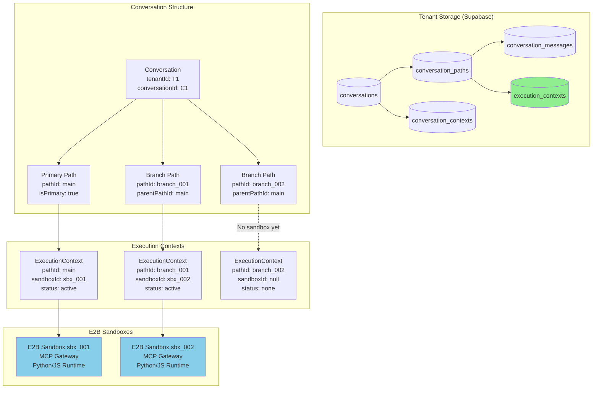

### Execution Context Manager Flow

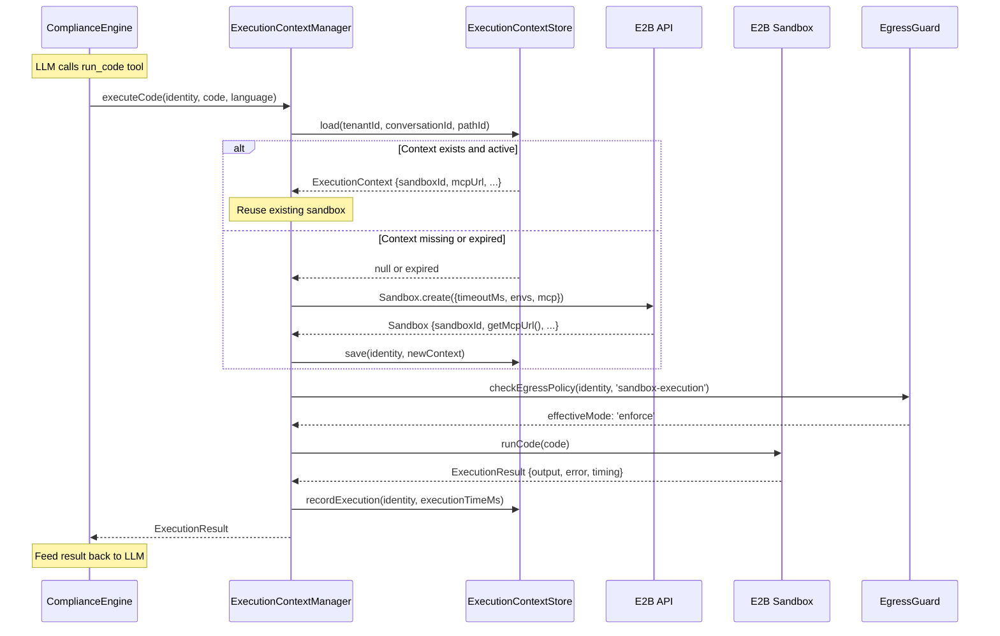

---

## Complete Request Flow with Code Execution

This diagram shows the complete flow when the LLM decides to execute code.

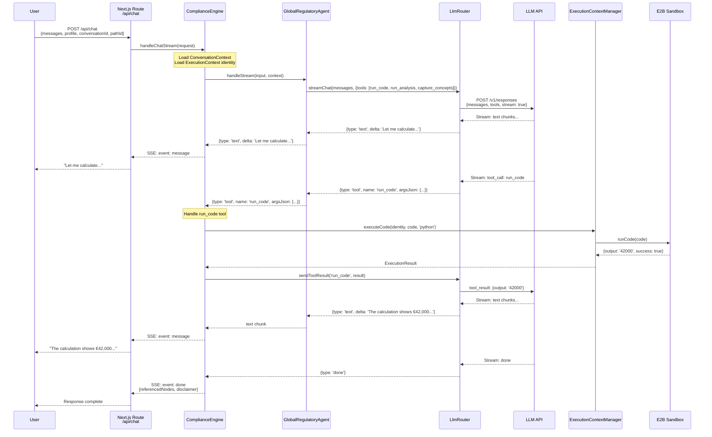

### Tool Call Decision Flow

```mermaid
flowchart TB
    subgraph "LLM Decision"
        UserQuestion[User asks:<br/>"What's the VAT on €200k turnover?"]

        LLMThinks{LLM Decides}

        JustAnswer[Answer directly<br/>from knowledge]
        UseCapture[Call capture_concepts<br/>for graph enrichment]
        UseCode[Call run_code<br/>for calculation]
        UseAnalysis[Call run_analysis<br/>for structured comparison]

        UserQuestion --> LLMThinks

        LLMThinks -->|Simple factual| JustAnswer
        LLMThinks -->|References concepts| UseCapture
        LLMThinks -->|Needs calculation| UseCode
        LLMThinks -->|Multiple scenarios| UseAnalysis
    end

    subgraph "Tool Handling"
        CaptureHandler[handleConceptChunk<br/>→ GraphWriteService]
        CodeHandler[handleRunCodeChunk<br/>→ ExecutionContextManager]
        AnalysisHandler[handleRunAnalysisChunk<br/>→ ScenarioEngine + ECM]

        UseCapture --> CaptureHandler
        UseCode --> CodeHandler
        UseAnalysis --> AnalysisHandler
    end

    subgraph "Results"
        TextStream[Text → UI Stream]
        GraphUpdate[Graph → Self-populate]
        ExecResult[Execution → Feed back to LLM]

        JustAnswer --> TextStream
        CaptureHandler --> GraphUpdate
        CodeHandler --> ExecResult
        AnalysisHandler --> ExecResult
    end

    style UseCode fill:#90EE90
    style UseAnalysis fill:#90EE90
    style CodeHandler fill:#87CEEB
    style AnalysisHandler fill:#87CEEB
```

---

## Execution Context Lifecycle

### State Diagram

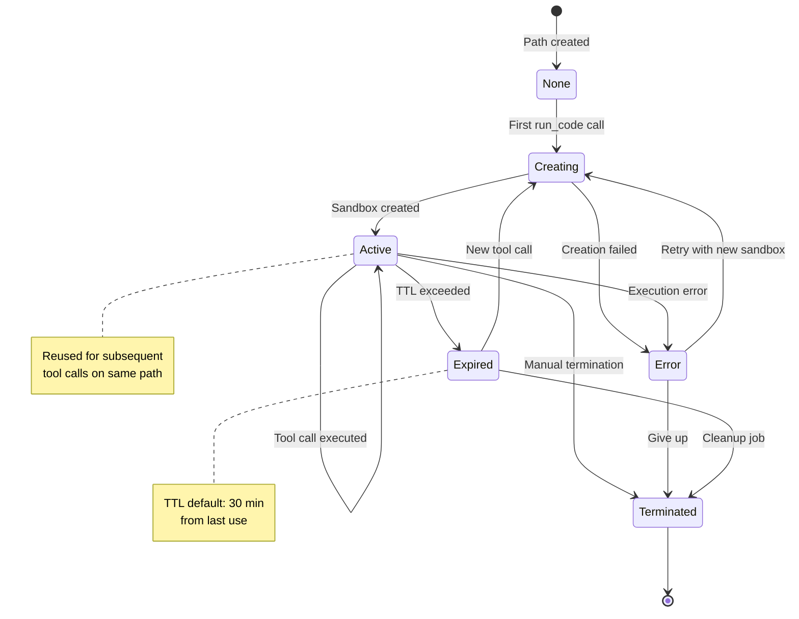

### Cleanup Flow

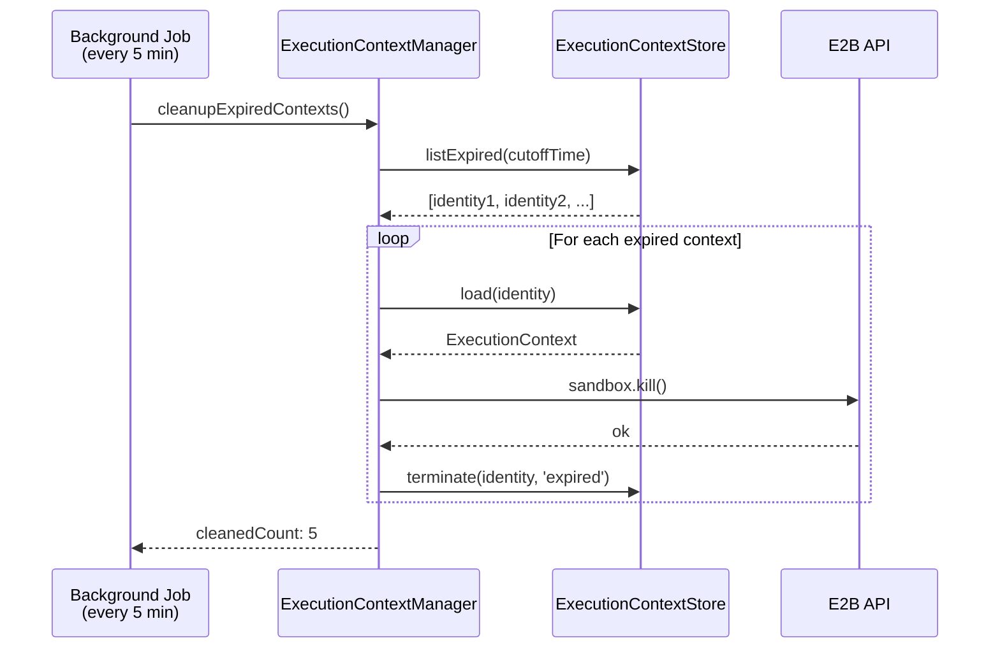

---

## Path Branching and Execution Contexts

### What Gets Inherited on Branch

When a user branches a conversation, it's important to understand what IS and IS NOT inherited:

| Context Type | Inherited? | Details |
|--------------|------------|---------|
| **Message History** (up to branch point) | ✅ YES | Branch sees M1, M2, M3 |
| **ConversationContext** (`activeNodeIds`) | ✅ YES | Copied at branch point |
| **ExecutionContext** (E2B sandbox) | ❌ NO | Branch gets fresh sandbox on first `run_code` |

**The branch continues the conversation as if it never branched** — same concepts, same history. Only the sandbox runtime state is isolated.

### Branch Creation Flow

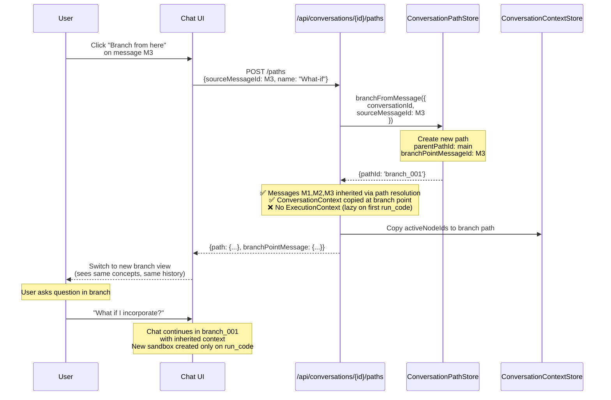

### Message Edit Flow

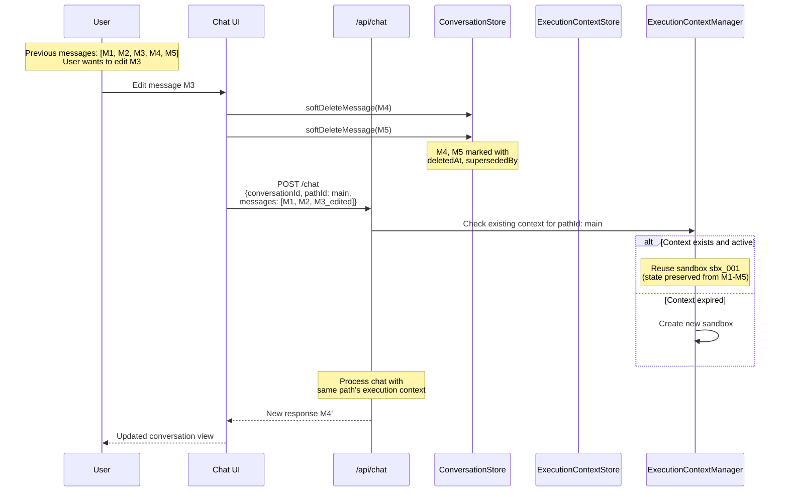

### Path Merge Flow

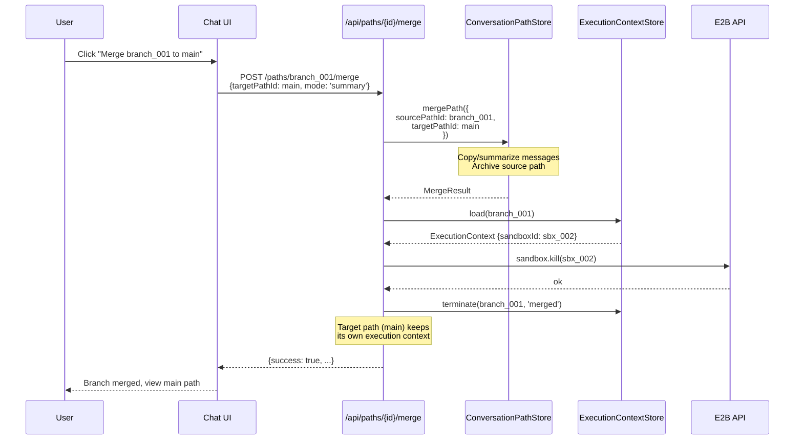

---

## UI Layer Architecture

(Unchanged from v0.6 - included for completeness)

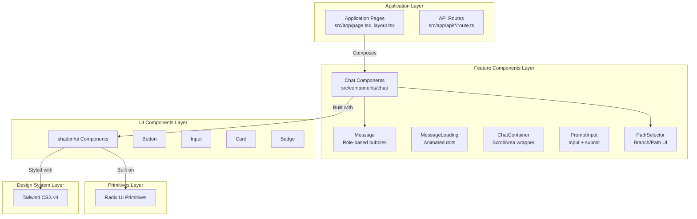

---

## LLM Provider Architecture

(Extended from v0.6 with tool handling)

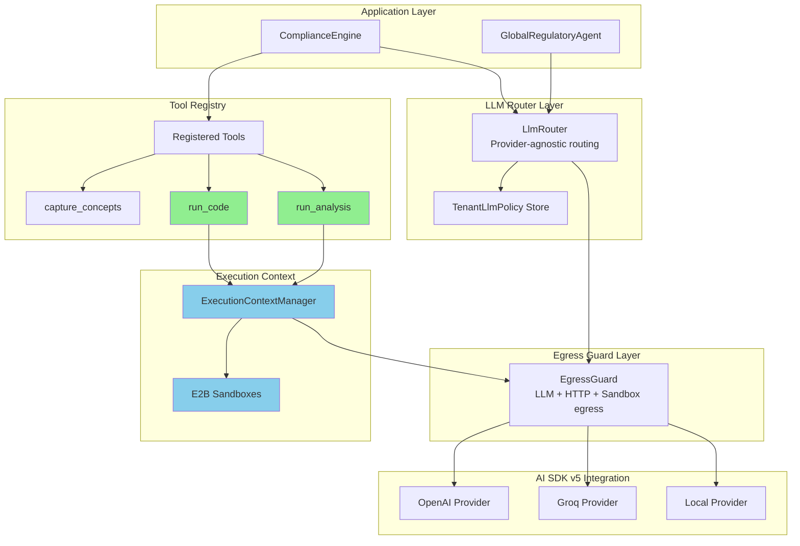

---

## Graph Streaming Architecture

(Unchanged from v0.6 - included for completeness)

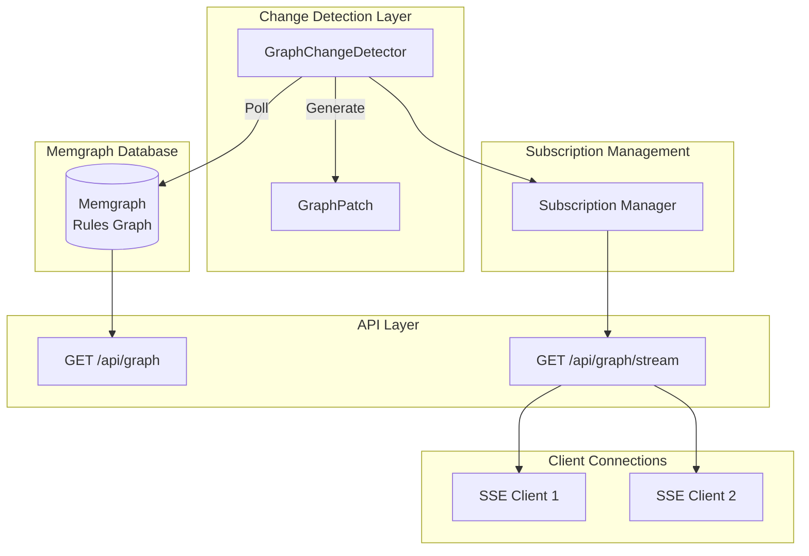

---

## Technology Stack (v0.7)

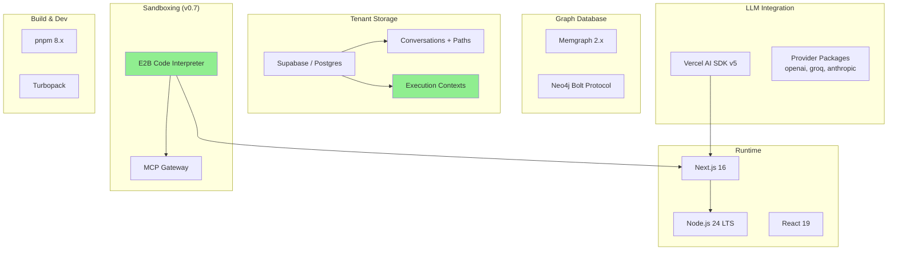

---

## Summary

These diagrams illustrate:

1. **E2B Execution Context Architecture**: Per-path sandbox management with lazy creation and reuse.
2. **Complete Request Flow**: End-to-end journey including code execution tool calls.
3. **Execution Context Lifecycle**: State management from creation through expiry/termination.
4. **Path Integration**: How branching, editing, and merging interact with execution contexts.
5. **Tool Calling Flow**: How the LLM decides to use tools and how results are fed back.

### Key Architectural Principles (v0.7)

- ✅ **Per-Path Isolation**: Each conversation path gets its own sandbox when needed.
- ✅ **Lazy Creation**: Sandboxes only created when LLM calls execution tools.
- ✅ **Sandbox Reuse**: Subsequent tool calls on same path reuse the sandbox.
- ✅ **TTL-Based Cleanup**: Sandboxes expire after inactivity period.
- ✅ **Egress Guard Integration**: All sandbox egress flows through EgressGuard.
- ✅ **Branch Isolation**: Branches don't inherit parent path's sandbox.
- ✅ **Edit Continuity**: Message edits reuse same path's sandbox.
- ✅ **UI Agnostic**: Frontend unaware of sandbox execution details.
