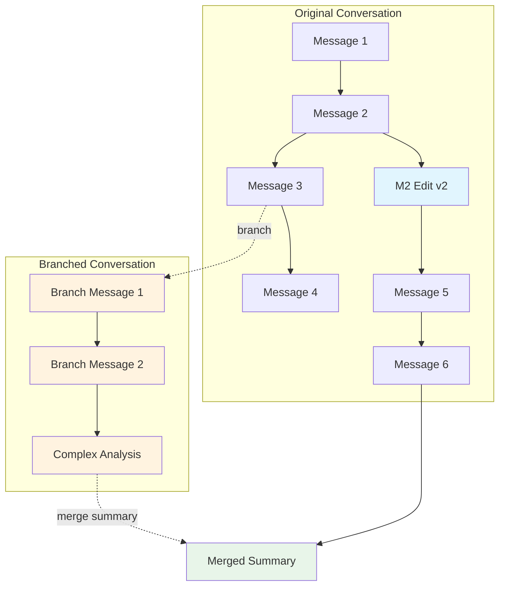

# Conversation Branching and Merging Architecture

> **Status**: ✅ Fully Implemented (Dec 2024)
> **Version**: 2.0 (Updated Dec 2027 - Legacy Pattern Removed)

## Executive Summary

This document describes the architecture for the conversation path system with branching, navigation, and merging capabilities. The system has been **fully implemented** and uses **100% path-based versioning** for all message operations.

**Key Capabilities**:

1. **Path-Aware Navigation**: When viewing previous message versions, the entire conversation path updates to show the true conversation history at that point
2. **Conversation Branching**: Create independent conversations from any message point (like ChatGPT, but enhanced)
3. **Conversation Merging**: Merge results from branched conversations back to the parent (gap in ChatGPT)

**Important**: As of December 2024, the legacy `supersededBy` pattern has been **completely removed** from the codebase. All message versioning now uses the path-based system.



---

## Part 1: Historical Context

### Previous Architecture (Pre-Dec 2024) - DEPRECATED

**Note**: This section is for historical reference only. The supersededBy pattern has been completely removed.

The previous system used a message versioning system that lacked path awareness:

**Database Schema (Legacy)**:
```sql
-- copilot_internal.conversation_messages (BEFORE path migration)
id uuid PRIMARY KEY
conversation_id uuid REFERENCES conversations(id)
role text CHECK (role in ('system','user','assistant'))
content text
metadata jsonb  -- Used to contain: { deletedAt?, supersededBy? } ← DEPRECATED
created_at timestamptz
```

**Legacy Version Chain Model** (REMOVED):
```typescript
// OLD: Messages formed linear chains via supersededBy ← NO LONGER USED
Message A (original)
  → metadata.supersededBy = Message A' (edited)  ← REMOVED Dec 2024
    → metadata.supersededBy = Message A'' (edited again)  ← REMOVED Dec 2024
```

### Limitations That Led to Path System

| Issue | Description | Solution |
|-------|-------------|----------|
| **No Path Awareness** | When viewing Message A, conversation still showed messages from Message A'' path | ✅ Path-based resolution |
| **No True Branching** | Could only edit/supersede, not create independent branches | ✅ conversation_paths table |
| **No Merge Capability** | Could not bring results back from parallel work | ✅ Path merging with AI summarization |
| **Flat Message List** | All messages stored linearly | ✅ Path-based organization |

---

## Part 2: Proposed Data Model

### 2.1 Enhanced Schema

```sql
-- New: Conversation paths table
CREATE TABLE copilot_internal.conversation_paths (
    id uuid PRIMARY KEY DEFAULT gen_random_uuid(),
    conversation_id uuid NOT NULL REFERENCES conversations(id) ON DELETE CASCADE,
    tenant_id uuid NOT NULL,

    -- Path lineage
    parent_path_id uuid REFERENCES conversation_paths(id) ON DELETE SET NULL,
    branch_point_message_id uuid REFERENCES conversation_messages(id) ON DELETE SET NULL,

    -- Path metadata
    name text,  -- Optional name for the path/branch
    is_primary boolean NOT NULL DEFAULT false,  -- The "main" path
    is_active boolean NOT NULL DEFAULT true,    -- Currently visible/active

    -- Merge tracking
    merged_to_path_id uuid REFERENCES conversation_paths(id) ON DELETE SET NULL,
    merged_at timestamptz,
    merge_summary_message_id uuid REFERENCES conversation_messages(id) ON DELETE SET NULL,

    created_at timestamptz NOT NULL DEFAULT now(),
    updated_at timestamptz NOT NULL DEFAULT now(),

    CONSTRAINT unique_primary_path UNIQUE (conversation_id, is_primary)
        WHERE is_primary = true
);

-- Enhanced: Messages now belong to paths
ALTER TABLE copilot_internal.conversation_messages
    ADD COLUMN path_id uuid REFERENCES conversation_paths(id) ON DELETE CASCADE,
    ADD COLUMN sequence_in_path integer,  -- Ordering within path
    ADD COLUMN is_branch_point boolean NOT NULL DEFAULT false,
    ADD COLUMN branched_to_paths uuid[] DEFAULT '{}';  -- Paths that branch from this message

-- Index for efficient path queries
CREATE INDEX idx_messages_path_sequence
    ON copilot_internal.conversation_messages(path_id, sequence_in_path);
CREATE INDEX idx_paths_conversation
    ON copilot_internal.conversation_paths(conversation_id, is_active);
CREATE INDEX idx_paths_parent
    ON copilot_internal.conversation_paths(parent_path_id) WHERE parent_path_id IS NOT NULL;
```

### 2.2 Path Resolution Algorithm

When a user navigates to view a previous message version, the system must resolve which messages to display:

```typescript
interface PathResolution {
  /** Messages visible in this path, in order */
  messages: ConversationMessage[];
  /** The active path being viewed */
  currentPath: ConversationPath;
  /** Branch points available from this path */
  branchPoints: BranchPoint[];
  /** Paths that can be merged into this one */
  mergeablePaths: ConversationPath[];
}

/**
 * Resolve the complete message list for a given path
 *
 * For paths with a parent, this includes:
 * 1. All messages from root path up to branch_point_message_id
 * 2. All messages in the current path after the branch point
 */
async function resolvePathMessages(
  pathId: string,
  tenantId: string
): Promise<ConversationMessage[]> {
  const path = await getPath(pathId, tenantId);

  if (!path.parentPathId) {
    // Root path - return all messages for this path
    return getMessagesForPath(pathId, tenantId);
  }

  // Child path - need to compose from parent
  const parentMessages = await resolvePathMessages(path.parentPathId, tenantId);

  // Find the branch point in parent messages
  const branchPointIndex = parentMessages.findIndex(
    m => m.id === path.branchPointMessageId
  );

  // Take parent messages up to and including branch point
  const inheritedMessages = parentMessages.slice(0, branchPointIndex + 1);

  // Get this path's own messages (after branch point)
  const ownMessages = await getMessagesForPath(pathId, tenantId);

  return [...inheritedMessages, ...ownMessages];
}
```

### 2.3 Path-Based Versioning Model

**As of December 2024**, the system uses **path-based versioning for ALL operations**. The legacy `supersededBy` mechanism has been removed.

```
MESSAGE EDIT (creates branch):
  User Message "What is X?" on Main Path
  → Edit to "What is Y?" creates NEW BRANCH
  → Original message remains on Main Path
  → Edited message and responses continue on new branch
  → Both paths viewable via PathToolbar
  → Can merge branch back to main later

EXPLICIT BRANCH (new path):
  User Message "What is X?" on Main Path
  → Branch creates new path from this point
  → New path has independent conversation
  → Original path unaffected
  → Can later merge results back
```

**Key Principle**: Every version of a conversation exists on its own path. There are no in-place edits or superseded messages.

---

## Part 3: TypeScript Interfaces

### 3.1 Core Types

```typescript
// packages/reg-intel-conversations/src/types/paths.ts

export interface ConversationPath {
  id: string;
  conversationId: string;
  tenantId: string;

  // Lineage
  parentPathId: string | null;
  branchPointMessageId: string | null;

  // Metadata
  name: string | null;
  isPrimary: boolean;
  isActive: boolean;

  // Merge state
  mergedToPathId: string | null;
  mergedAt: Date | null;
  mergeSummaryMessageId: string | null;

  createdAt: Date;
  updatedAt: Date;
}

export interface ConversationMessage {
  id: string;
  conversationId: string;
  pathId: string;
  sequenceInPath: number;

  role: 'user' | 'assistant' | 'system';
  content: string;
  metadata?: MessageMetadata;

  // Soft delete tracking
  deletedAt?: Date | null;
  // Note: supersededBy removed Dec 2024 - use path-based versioning

  // Branch tracking
  isBranchPoint: boolean;
  branchedToPaths: string[];

  createdAt: Date;
}

export interface BranchPoint {
  messageId: string;
  messageContent: string;
  messageRole: 'user' | 'assistant';
  branchedPaths: ConversationPath[];
  canBranch: boolean;
}

export interface MergeRequest {
  sourcePathId: string;
  targetPathId: string;
  mergeMode: 'summary' | 'full' | 'selective';
  selectedMessageIds?: string[];  // For selective merge
  summaryPrompt?: string;         // For summary merge
}

export interface MergeResult {
  success: boolean;
  summaryMessageId?: string;
  mergedMessageIds?: string[];
  targetPath: ConversationPath;
}
```

### 3.2 Enhanced Store Interface

```typescript
// packages/reg-intel-conversations/src/conversationStores.ts

export interface ConversationPathStore {
  // Path CRUD
  createPath(input: {
    tenantId: string;
    conversationId: string;
    parentPathId?: string | null;
    branchPointMessageId?: string | null;
    name?: string | null;
    isPrimary?: boolean;
  }): Promise<{ pathId: string }>;

  getPath(input: {
    tenantId: string;
    pathId: string;
  }): Promise<ConversationPath | null>;

  listPaths(input: {
    tenantId: string;
    conversationId: string;
    includeInactive?: boolean;
  }): Promise<ConversationPath[]>;

  updatePath(input: {
    tenantId: string;
    pathId: string;
    name?: string | null;
    isActive?: boolean;
  }): Promise<void>;

  // Path resolution
  resolvePathMessages(input: {
    tenantId: string;
    pathId: string;
    includeDeleted?: boolean;
  }): Promise<ConversationMessage[]>;

  // Branching
  branchFromMessage(input: {
    tenantId: string;
    conversationId: string;
    sourceMessageId: string;
    userId?: string | null;
    branchName?: string | null;
  }): Promise<{ pathId: string; conversationId: string }>;

  // Merging
  mergePath(input: {
    tenantId: string;
    sourcePathId: string;
    targetPathId: string;
    mergeMode: 'summary' | 'full' | 'selective';
    selectedMessageIds?: string[];
    summaryContent?: string;
    userId?: string | null;
  }): Promise<MergeResult>;

  // Query helpers
  getActivePath(input: {
    tenantId: string;
    conversationId: string;
  }): Promise<ConversationPath | null>;

  getBranchPointsForPath(input: {
    tenantId: string;
    pathId: string;
  }): Promise<BranchPoint[]>;
}
```

---

## Part 4: UI/UX Design

### 4.1 Path-Aware Message Navigation

When viewing message versions, the entire conversation below updates:

```
┌─────────────────────────────────────────────────────────────────┐
│  Path: main  [▼]        Viewing: Version 1 of 3                 │
│                         ──────────────────────                   │
│  ┌─────────────────────────────────────────────────────────┐   │
│  │ 👤 You                                                   │   │
│  │ What are the tax obligations for directors?              │   │
│  │                                                          │   │
│  │                    [◀] 1 / 3 [▶]                        │   │
│  │                    Original • Dec 1                      │   │
│  └─────────────────────────────────────────────────────────┘   │
│                                                                  │
│  ┌─────────────────────────────────────────────────────────┐   │
│  │ 🤖 Assistant                                             │   │
│  │ Directors in Ireland have several tax obligations...     │   │
│  │ (This is the ORIGINAL response to version 1)             │   │
│  └─────────────────────────────────────────────────────────┘   │
│                                                                  │
│  ─── Messages below update based on selected version ───       │
│                                                                  │
└─────────────────────────────────────────────────────────────────┘

After clicking [▶] to version 2:

┌─────────────────────────────────────────────────────────────────┐
│  Path: main  [▼]        Viewing: Version 2 of 3                 │
│                         ──────────────────────                   │
│  ┌─────────────────────────────────────────────────────────┐   │
│  │ 👤 You                                                   │   │
│  │ What are the PENSION obligations for directors?          │   │
│  │                                                          │   │
│  │                    [◀] 2 / 3 [▶]                        │   │
│  │                    Edited • Dec 2                        │   │
│  └─────────────────────────────────────────────────────────┘   │
│                                                                  │
│  ┌─────────────────────────────────────────────────────────┐   │
│  │ 🤖 Assistant                                             │   │
│  │ Directors in Ireland have pension obligations...         │   │
│  │ (Different response for version 2)                       │   │
│  └─────────────────────────────────────────────────────────┘   │
│                                                                  │
│  ┌─────────────────────────────────────────────────────────┐   │
│  │ 👤 You                                                   │   │
│  │ Tell me more about auto-enrollment...                    │   │
│  │ (Follow-up only exists in version 2 path)                │   │
│  └─────────────────────────────────────────────────────────┘   │
│                                                                  │
└─────────────────────────────────────────────────────────────────┘
```

### 4.2 Branch Creation UI

```
┌─────────────────────────────────────────────────────────────────┐
│  ┌─────────────────────────────────────────────────────────┐   │
│  │ 🤖 Assistant                                   [⋮]      │   │
│  │ Directors have several PRSI obligations...              │   │
│  │                                                          │   │
│  │  [📋 Copy] [✏️ Edit] [🌿 Branch] [🔗 Share]             │   │
│  └─────────────────────────────────────────────────────────┘   │
│                                                                  │
└─────────────────────────────────────────────────────────────────┘

After clicking [🌿 Branch]:

┌─────────────────────────────────────────────────────────────────┐
│  ┌─────────────────────────────────────────────────────────┐   │
│  │           🌿 Create Branch                               │   │
│  ├─────────────────────────────────────────────────────────┤   │
│  │                                                          │   │
│  │  Branch from this message to explore a different         │   │
│  │  direction without affecting the main conversation.      │   │
│  │                                                          │   │
│  │  Branch name (optional):                                 │   │
│  │  ┌─────────────────────────────────────────────────┐    │   │
│  │  │ PRSI deep dive                                  │    │   │
│  │  └─────────────────────────────────────────────────┘    │   │
│  │                                                          │   │
│  │  ○ Open in current view                                  │   │
│  │  ● Open in new tab                                       │   │
│  │                                                          │   │
│  │                      [Cancel]  [Create Branch]           │   │
│  └─────────────────────────────────────────────────────────┘   │
│                                                                  │
└─────────────────────────────────────────────────────────────────┘
```

### 4.3 Path Selector

```
┌─────────────────────────────────────────────────────────────────┐
│  Path: main  [▼]                                                │
│  ┌─────────────────────────────────────────────────────────┐   │
│  │  📍 main (current)                         Primary       │   │
│  │     12 messages • Last active 2 min ago                  │   │
│  ├─────────────────────────────────────────────────────────┤   │
│  │  🌿 PRSI deep dive                                       │   │
│  │     Branched from: "Directors have several..."          │   │
│  │     5 messages • Created Dec 5                           │   │
│  │     [View] [Merge to main] [Delete]                      │   │
│  ├─────────────────────────────────────────────────────────┤   │
│  │  🌿 Cross-border analysis                                │   │
│  │     Branched from: "For EU coordination..."             │   │
│  │     8 messages • Created Dec 4                           │   │
│  │     [View] [Merge to main] [Delete]                      │   │
│  ├─────────────────────────────────────────────────────────┤   │
│  │  ✓ Tax implications (merged)                             │   │
│  │     Merged to main on Dec 3                              │   │
│  │     [View archived]                                       │   │
│  └─────────────────────────────────────────────────────────┘   │
│                                                                  │
└─────────────────────────────────────────────────────────────────┘
```

### 4.4 Merge Dialog

```
┌─────────────────────────────────────────────────────────────────┐
│  ┌─────────────────────────────────────────────────────────┐   │
│  │           🔀 Merge Branch                                │   │
│  ├─────────────────────────────────────────────────────────┤   │
│  │                                                          │   │
│  │  Merge "PRSI deep dive" → "main"                        │   │
│  │                                                          │   │
│  │  Merge mode:                                             │   │
│  │  ┌─────────────────────────────────────────────────┐    │   │
│  │  │ ● Summary (recommended)                         │    │   │
│  │  │   AI summarizes key findings into a single      │    │   │
│  │  │   message appended to main conversation         │    │   │
│  │  │                                                  │    │   │
│  │  │ ○ Full merge                                     │    │   │
│  │  │   All messages from branch appended to main     │    │   │
│  │  │   (may bloat conversation)                       │    │   │
│  │  │                                                  │    │   │
│  │  │ ○ Selective                                      │    │   │
│  │  │   Choose specific messages to include           │    │   │
│  │  └─────────────────────────────────────────────────┘    │   │
│  │                                                          │   │
│  │  Summary prompt (for AI summarization):                  │   │
│  │  ┌─────────────────────────────────────────────────┐    │   │
│  │  │ Summarize the key findings about PRSI          │    │   │
│  │  │ obligations from this branch conversation.      │    │   │
│  │  └─────────────────────────────────────────────────┘    │   │
│  │                                                          │   │
│  │  ☑ Archive branch after merge                            │   │
│  │  ☐ Keep branch active for continued exploration          │   │
│  │                                                          │   │
│  │                      [Cancel]  [Preview Merge]           │   │
│  └─────────────────────────────────────────────────────────┘   │
│                                                                  │
└─────────────────────────────────────────────────────────────────┘
```

---

## Part 5: API Design

### 5.1 REST Endpoints

```typescript
// Path Management
GET    /api/conversations/:conversationId/paths
POST   /api/conversations/:conversationId/paths          // Create new path
GET    /api/conversations/:conversationId/paths/:pathId
PATCH  /api/conversations/:conversationId/paths/:pathId  // Update path
DELETE /api/conversations/:conversationId/paths/:pathId  // Delete/archive path

// Path Messages
GET    /api/conversations/:conversationId/paths/:pathId/messages

// Branching
POST   /api/conversations/:conversationId/branch
       Body: { sourceMessageId, branchName?, openInNewTab? }
       Response: { pathId, conversationId }

// Merging
POST   /api/conversations/:conversationId/paths/:pathId/merge
       Body: { targetPathId, mergeMode, selectedMessageIds?, summaryPrompt? }
       Response: { success, summaryMessageId?, mergedMessageIds? }

// Active Path
GET    /api/conversations/:conversationId/active-path
PUT    /api/conversations/:conversationId/active-path
       Body: { pathId }
```

### 5.2 SSE Events

```typescript
// New event types for real-time path updates
type ConversationPathEventType =
  | 'path:created'      // New branch created
  | 'path:updated'      // Path metadata changed
  | 'path:deleted'      // Path deleted/archived
  | 'path:merged'       // Path merged to another
  | 'path:active'       // Active path changed

interface PathEventPayload {
  'path:created': {
    path: ConversationPath;
    branchPointMessage: ConversationMessage;
  };
  'path:updated': {
    pathId: string;
    changes: Partial<ConversationPath>;
  };
  'path:deleted': {
    pathId: string;
    reason: 'deleted' | 'archived';
  };
  'path:merged': {
    sourcePathId: string;
    targetPathId: string;
    summaryMessageId?: string;
  };
  'path:active': {
    pathId: string;
  };
}
```

---

## Part 6: Frontend State Management

### 6.1 Path State

```typescript
// apps/demo-web/src/hooks/useConversationPaths.ts

interface ConversationPathState {
  // All paths for this conversation
  paths: ConversationPath[];

  // Currently viewed path
  activePathId: string | null;
  activePath: ConversationPath | null;

  // Messages for active path (resolved)
  messages: ConversationMessage[];

  // Version navigation state (for edited messages)
  activeVersionIndex: Record<string, number>;

  // Currently viewing a specific version's path?
  viewingVersionPath: {
    messageId: string;
    versionIndex: number;
  } | null;

  // Loading states
  isLoadingPaths: boolean;
  isLoadingMessages: boolean;
  isBranching: boolean;
  isMerging: boolean;
}

interface ConversationPathActions {
  // Load/refresh
  loadPaths: () => Promise<void>;
  loadPathMessages: (pathId: string) => Promise<void>;

  // Navigation
  setActivePath: (pathId: string) => void;
  navigateToVersion: (messageId: string, versionIndex: number) => void;
  exitVersionView: () => void;

  // Branching
  branchFromMessage: (messageId: string, name?: string) => Promise<string>;

  // Merging
  mergePath: (sourcePathId: string, mode: MergeMode) => Promise<void>;
  previewMerge: (sourcePathId: string, mode: MergeMode) => Promise<MergePreview>;

  // Path management
  renamePath: (pathId: string, name: string) => Promise<void>;
  deletePath: (pathId: string) => Promise<void>;
  archivePath: (pathId: string) => Promise<void>;
}

const useConversationPaths = (conversationId: string): [
  ConversationPathState,
  ConversationPathActions
] => {
  // Implementation
};
```

### 6.2 Path Resolution in UI

```typescript
// apps/demo-web/src/lib/pathResolution.ts

/**
 * Given a version navigation action, determine which path to display
 */
function resolvePathForVersion(
  state: ConversationPathState,
  messageId: string,
  versionIndex: number
): ResolvedPath {
  const allVersions = getMessageVersionChain(state.messages, messageId);
  const targetVersion = allVersions[versionIndex];

  // Find which path this version belongs to
  const targetPath = state.paths.find(p => p.id === targetVersion.pathId);

  if (!targetPath) {
    throw new Error('Version path not found');
  }

  return {
    path: targetPath,
    messagesUpToVersion: resolveMessagesUpTo(state, targetPath, targetVersion),
    remainingMessages: resolveMessagesAfter(state, targetPath, targetVersion),
  };
}

/**
 * Build the complete message list for a given path,
 * handling inheritance from parent paths
 */
function buildPathMessageList(
  paths: ConversationPath[],
  allMessages: ConversationMessage[],
  targetPathId: string
): ConversationMessage[] {
  const path = paths.find(p => p.id === targetPathId);
  if (!path) return [];

  // Build message list recursively from root
  const messageList: ConversationMessage[] = [];
  const pathChain = getPathChainToRoot(paths, path);

  for (const p of pathChain) {
    const pathMessages = allMessages
      .filter(m => m.pathId === p.id)
      .sort((a, b) => a.sequenceInPath - b.sequenceInPath);

    if (p.id === targetPathId) {
      // For target path, include all messages
      messageList.push(...pathMessages);
    } else {
      // For ancestor paths, include up to branch point
      const branchPointIdx = pathMessages.findIndex(
        m => m.id === path.branchPointMessageId
      );
      if (branchPointIdx >= 0) {
        messageList.push(...pathMessages.slice(0, branchPointIdx + 1));
      }
    }
  }

  return messageList;
}
```

---

## Part 7: Migration Strategy

### 7.1 Database Migration

```sql
-- Migration: 20241207000000_add_conversation_paths.sql

-- Step 1: Create paths table
CREATE TABLE copilot_internal.conversation_paths (
    id uuid PRIMARY KEY DEFAULT gen_random_uuid(),
    conversation_id uuid NOT NULL REFERENCES copilot_internal.conversations(id) ON DELETE CASCADE,
    tenant_id uuid NOT NULL,
    parent_path_id uuid REFERENCES copilot_internal.conversation_paths(id) ON DELETE SET NULL,
    branch_point_message_id uuid,  -- FK added after messages updated
    name text,
    is_primary boolean NOT NULL DEFAULT false,
    is_active boolean NOT NULL DEFAULT true,
    merged_to_path_id uuid REFERENCES copilot_internal.conversation_paths(id) ON DELETE SET NULL,
    merged_at timestamptz,
    merge_summary_message_id uuid,  -- FK added after messages updated
    created_at timestamptz NOT NULL DEFAULT now(),
    updated_at timestamptz NOT NULL DEFAULT now()
);

-- Step 2: Add path columns to messages
ALTER TABLE copilot_internal.conversation_messages
    ADD COLUMN path_id uuid,
    ADD COLUMN sequence_in_path integer,
    ADD COLUMN is_branch_point boolean NOT NULL DEFAULT false,
    ADD COLUMN branched_to_paths uuid[] DEFAULT '{}';

-- Step 3: Create primary path for each existing conversation
INSERT INTO copilot_internal.conversation_paths (conversation_id, tenant_id, is_primary)
SELECT DISTINCT conversation_id, tenant_id, true
FROM copilot_internal.conversation_messages;

-- Step 4: Assign existing messages to primary paths
WITH primary_paths AS (
    SELECT id, conversation_id, tenant_id
    FROM copilot_internal.conversation_paths
    WHERE is_primary = true
),
message_sequences AS (
    SELECT
        m.id,
        m.conversation_id,
        pp.id as path_id,
        ROW_NUMBER() OVER (
            PARTITION BY m.conversation_id
            ORDER BY m.created_at
        ) as seq
    FROM copilot_internal.conversation_messages m
    JOIN primary_paths pp ON pp.conversation_id = m.conversation_id
)
UPDATE copilot_internal.conversation_messages m
SET
    path_id = ms.path_id,
    sequence_in_path = ms.seq
FROM message_sequences ms
WHERE m.id = ms.id;

-- Step 5: Add foreign key constraints
ALTER TABLE copilot_internal.conversation_messages
    ADD CONSTRAINT fk_message_path
    FOREIGN KEY (path_id) REFERENCES copilot_internal.conversation_paths(id) ON DELETE CASCADE;

ALTER TABLE copilot_internal.conversation_paths
    ADD CONSTRAINT fk_branch_point_message
    FOREIGN KEY (branch_point_message_id) REFERENCES copilot_internal.conversation_messages(id) ON DELETE SET NULL;

ALTER TABLE copilot_internal.conversation_paths
    ADD CONSTRAINT fk_merge_summary_message
    FOREIGN KEY (merge_summary_message_id) REFERENCES copilot_internal.conversation_messages(id) ON DELETE SET NULL;

-- Step 6: Make path_id NOT NULL after migration
ALTER TABLE copilot_internal.conversation_messages
    ALTER COLUMN path_id SET NOT NULL;

-- Step 7: Create indexes
CREATE INDEX idx_messages_path_sequence
    ON copilot_internal.conversation_messages(path_id, sequence_in_path);
CREATE INDEX idx_paths_conversation
    ON copilot_internal.conversation_paths(conversation_id, is_active);
CREATE INDEX idx_paths_parent
    ON copilot_internal.conversation_paths(parent_path_id) WHERE parent_path_id IS NOT NULL;

-- Step 8: Update RLS policies
CREATE POLICY conversation_paths_service_role_full_access
    ON copilot_internal.conversation_paths
    FOR ALL TO service_role
    USING (true) WITH CHECK (true);

CREATE POLICY conversation_paths_tenant_read
    ON copilot_internal.conversation_paths
    FOR SELECT TO authenticated
    USING (tenant_id = public.current_tenant_id());

CREATE POLICY conversation_paths_tenant_write
    ON copilot_internal.conversation_paths
    FOR INSERT TO authenticated
    WITH CHECK (tenant_id = public.current_tenant_id());

CREATE POLICY conversation_paths_tenant_update
    ON copilot_internal.conversation_paths
    FOR UPDATE TO authenticated
    USING (tenant_id = public.current_tenant_id())
    WITH CHECK (tenant_id = public.current_tenant_id());

ALTER TABLE copilot_internal.conversation_paths ENABLE ROW LEVEL SECURITY;

-- Step 9: Create view for paths
CREATE OR REPLACE VIEW public.conversation_paths_view AS
    WITH request_context AS (
        SELECT public.current_tenant_id() as tenant_id, auth.role() as requester_role
    )
    SELECT p.id,
           p.conversation_id,
           p.tenant_id,
           p.parent_path_id,
           p.branch_point_message_id,
           p.name,
           p.is_primary,
           p.is_active,
           p.merged_to_path_id,
           p.merged_at,
           p.merge_summary_message_id,
           p.created_at,
           p.updated_at
    FROM copilot_internal.conversation_paths p
    CROSS JOIN request_context ctx
    WHERE ctx.requester_role = 'service_role'
       OR (ctx.tenant_id IS NOT NULL AND p.tenant_id = ctx.tenant_id);

GRANT SELECT ON public.conversation_paths_view TO authenticated, service_role;
```

### 7.2 Phased Rollout

| Phase | Description | Changes |
|-------|-------------|---------|
| **Phase 1: Schema** | Add paths table and columns | Database migration, backward compatible |
| **Phase 2: Backend** | Implement path store methods | New API endpoints, existing endpoints unchanged |
| **Phase 3: Navigation** | Path-aware version navigation | Frontend updates to page.tsx |
| **Phase 4: Branching** | Branch creation UI and logic | New components and dialogs |
| **Phase 5: Merging** | Merge capability with AI summary | Integration with AI summarization |
| **Phase 6: Polish** | Visual indicators, animations | UX refinements |

---

## Part 8: Path-Based Version Resolution

### 8.1 How Edits Create Explicit Paths

**Current Implementation (Dec 2024+)**: When a user edits a message, an **explicit new path** is created:

1. UI calls `createBranch()` with the edited message as branch point
2. New path is created in `conversation_paths` table
3. Edited message and its responses are added to the new path
4. Original message remains unchanged on the original path
5. User can switch between paths via PathToolbar

```typescript
// Path-based approach: each version is an explicit path
interface ExplicitPath {
  /** The path record from conversation_paths table */
  path: ConversationPath;

  /** The message that serves as the branch point */
  branchPoint: ConversationMessage;

  /** All messages on this path (after inheriting from parent) */
  messages: ConversationMessage[];
}

/**
 * When viewing a specific path, the system resolves messages by:
 */
function getMessagesForVersionView(
  messages: ConversationMessage[],
  targetMessageId: string,
  targetVersionIndex: number
): ConversationMessage[] {
  const versionChain = buildVersionChain(messages, targetMessageId);
  const targetVersion = versionChain[targetVersionIndex];

  if (!targetVersion) {
    throw new Error('Version not found');
  }

  // Find all messages that come after this version in time,
  // and whose path is consistent with this version
  const messagesAfterVersion = messages.filter(m => {
    // Must be after the target version
    if (m.createdAt <= targetVersion.createdAt) return false;

    // Must not be a superseding version of the target
    if (isInVersionChain(messages, targetMessageId, m.id)) return false;

    // Must be in the same explicit path
    if (m.pathId !== targetVersion.pathId) return false;

    // If there's a later version of target, only include messages
    // that were created before that later version
    const nextVersion = versionChain[targetVersionIndex + 1];
    if (nextVersion && m.createdAt >= nextVersion.createdAt) return false;

    return true;
  });

  // Get all messages up to and including target version
  const messagesUpToVersion = messages.filter(m =>
    m.createdAt <= targetVersion.createdAt &&
    !m.deletedAt &&
    (m.id === targetVersion.id || !isInVersionChain(messages, targetMessageId, m.id))
  );

  return [...messagesUpToVersion, ...messagesAfterVersion];
}
```

### 8.2 Visual Version Path Indicator

```
┌─────────────────────────────────────────────────────────────────┐
│  PATH INDICATOR BAR                                             │
│  ─────────────────────────────────────────────────────────────  │
│                                                                  │
│  [Main] ────●────●────●────●                                    │
│                  │    ╰─●──●──● (Edit 1)                        │
│                  │         ╰──●──● (Edit 2 of Edit 1)           │
│                  ╰─●──●  (Branch: PRSI Analysis)                │
│                                                                  │
│  ● = message   ─ = conversation flow   │ = branch point         │
│                                                                  │
│  Currently viewing: Main path, position 4                       │
│                                                                  │
└─────────────────────────────────────────────────────────────────┘
```

---

## Part 9: AI-Powered Merge Summarization

### 9.1 Merge Summary Prompt Engineering

```typescript
// packages/reg-intel-core/src/orchestrator/mergeSummarizer.ts

const MERGE_SUMMARY_SYSTEM_PROMPT = `
You are a conversation summarizer. Your task is to create a concise summary
of a branched conversation thread to merge back into the main conversation.

Guidelines:
1. Capture the KEY FINDINGS and CONCLUSIONS from the branch
2. Include any specific regulatory references or citations discovered
3. Note any action items or recommendations
4. Keep the summary focused and actionable
5. Use the same tone and style as the main conversation
6. Format as a single coherent message, not bullet points
7. Maximum 2-3 paragraphs

The user may provide specific summarization instructions.
`;

interface MergeSummaryInput {
  /** Messages from the branch to summarize */
  branchMessages: ConversationMessage[];

  /** The message where the branch originated */
  branchPointMessage: ConversationMessage;

  /** Recent context from the main conversation */
  mainConversationContext: ConversationMessage[];

  /** User's custom summarization prompt */
  customPrompt?: string;
}

async function generateMergeSummary(
  input: MergeSummaryInput,
  llmClient: LLMClient
): Promise<string> {
  const branchContent = input.branchMessages
    .map(m => `[${m.role.toUpperCase()}]: ${m.content}`)
    .join('\n\n');

  const userPrompt = `
Branch Point Message:
${input.branchPointMessage.content}

Branch Conversation:
${branchContent}

${input.customPrompt ? `Summarization Instructions: ${input.customPrompt}` : ''}

Please provide a summary to merge back into the main conversation.
`;

  return await llmClient.complete({
    system: MERGE_SUMMARY_SYSTEM_PROMPT,
    user: userPrompt,
    temperature: 0.3,
    maxTokens: 500,
  });
}
```

### 9.2 Merge Result Message Format

```typescript
interface MergeSummaryMessage {
  role: 'system';
  content: string;
  metadata: {
    type: 'merge_summary';
    sourcePathId: string;
    sourcePathName: string | null;
    mergedMessageCount: number;
    branchPointMessageId: string;
    summarizedAt: string;
    summarizationPrompt?: string;
  };
}

// Example merged message:
{
  role: 'system',
  content: `
**Branch Summary: PRSI Deep Dive** (5 messages merged)

After detailed analysis of PRSI obligations, the key findings are:

Class S contributions apply to all self-employed individuals with income over €5,000,
currently at 4% of reckonable income with a minimum contribution of €500. Directors
of proprietary companies are classified as Class S unless paid through PAYE as
employees. Recent changes in Budget 2024 introduced a 0.1% increase effective from
October 2024.

The branch also identified that cross-border workers may be subject to EU Regulation
883/2004, requiring coordination with the home country's social security system.
A1 certificates should be obtained for temporary assignments.
`,
  metadata: {
    type: 'merge_summary',
    sourcePathId: 'uuid-of-prsi-branch',
    sourcePathName: 'PRSI Deep Dive',
    mergedMessageCount: 5,
    branchPointMessageId: 'uuid-of-branch-point',
    summarizedAt: '2024-12-07T10:30:00Z',
  }
}
```

---

## Part 10: Implementation Checklist

### Database
- [ ] Create `conversation_paths` table
- [ ] Add path columns to `conversation_messages`
- [ ] Migrate existing conversations to use paths
- [ ] Update RLS policies
- [ ] Create views for path data

### Backend (reg-intel-conversations)
- [ ] Add `ConversationPath` interface and types
- [ ] Implement `SupabaseConversationPathStore`
- [ ] Add path resolution methods
- [ ] Implement branching logic
- [ ] Implement merging logic

### Backend (reg-intel-next-adapter)
- [ ] Add path API routes
- [ ] Add branch endpoint
- [ ] Add merge endpoint
- [ ] Add SSE events for path updates

### Frontend (demo-web)
- [ ] Create `useConversationPaths` hook
- [ ] Update message rendering for path awareness
- [ ] Implement version-to-path navigation
- [ ] Create path selector component
- [ ] Create branch dialog component
- [ ] Create merge dialog component
- [ ] Add path indicator visualizations
- [ ] Update keyboard shortcuts

### AI Integration (reg-intel-core)
- [ ] Create merge summarization prompts
- [ ] Implement summary generation
- [ ] Add merge preview capability

---

## Part 11: Future Enhancements

### 11.1 Path Comparison View
Side-by-side comparison of two paths showing divergence:

```
┌────────────────────────┬────────────────────────┐
│      Main Path         │    PRSI Branch         │
├────────────────────────┼────────────────────────┤
│ Q: Tax obligations?    │ Q: Tax obligations?    │ ← Common
│ A: Directors have...   │ A: Directors have...   │ ← Common
├────────────────────────┼────────────────────────┤
│ Q: Tell me about USC   │ Q: More about PRSI?    │ ← Divergence
│ A: USC is charged...   │ A: PRSI Class S...     │
│                        │ Q: What about Class A? │
│                        │ A: Class A applies...  │
└────────────────────────┴────────────────────────┘
```

### 11.2 Path Templates
Pre-defined branching patterns for common workflows:

- **Deep Dive**: Branch for detailed exploration, auto-summarize back
- **Alternative Analysis**: Compare two approaches side-by-side
- **Verification**: Branch to fact-check, merge findings
- **Scenario Planning**: Branch for each scenario, compare outcomes

### 11.3 Collaborative Paths
Multiple users working on different branches simultaneously:

- Real-time presence indicators on paths
- Lock/unlock paths for exclusive editing
- Notification when paths are merged
- Conflict resolution for concurrent edits

---

## Conclusion

**Implementation Status**: ✅ Fully Implemented (December 2024)

This architecture has been successfully implemented and provides a comprehensive solution for conversation branching and merging:

1. **✅ Solves path navigation**: Viewing specific paths shows the correct conversation history
2. **✅ Enables exploration**: Users can branch to explore without affecting main conversation
3. **✅ Supports complex workflows**: Merge summaries allow bringing insights back without bloat
4. **✅ Maintains data integrity**: All messages preserved, paths provide organizational structure
5. **✅ Scales gracefully**: Path resolution is efficient, database fully migrated
6. **✅ Clean codebase**: Legacy `supersededBy` pattern completely removed (Dec 2024)

The system uses **100% path-based versioning** for all message operations, providing a superset of ChatGPT's capabilities plus unique merge functionality. All message edits create explicit paths, ensuring clean version control and superior user experience.
