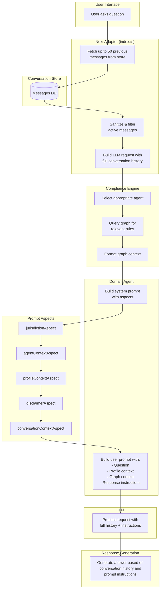

# Conversation Response Flow

This document explains how conversation messages flow through the regulatory intelligence copilot and where response content is generated.

## Overview

When a user asks a question, the system:
1. Retrieves up to 50 previous messages from the conversation store
2. Passes the full conversation history to the LLM
3. Applies prompt "aspects" that add context (jurisdiction, profile, disclaimers)
4. The selected agent builds a user prompt with specific instructions
5. The LLM generates a response following those instructions

## Flow Diagram

## Key Components

### Conversation History Retrieval

Located in `packages/reg-intel-next-adapter/src/index.ts:640-666`:

- Fetches up to 50 previous messages from the conversation store
- Filters out soft-deleted messages
- Maps messages to `{role, content}` format for LLM consumption

This is how the LLM knows about previous answers in the conversation.

### Prompt Aspects

Located in `packages/reg-intel-prompts/src/promptAspects.ts`:

Aspects are middleware that compose the system prompt:

| Aspect | Purpose |
|--------|---------|
| `jurisdictionAspect` | Adds jurisdiction context (e.g., "rules from: IE") |
| `agentContextAspect` | Adds agent-specific instructions |
| `profileContextAspect` | Adds user persona (e.g., "single-director company owner") |
| `disclaimerAspect` | Ensures non-advice disclaimer is present |
| `conversationContextAspect` | Adds active graph concepts from previous turns |

### Agent User Prompt

Located in domain agents (e.g., `packages/reg-intel-core/src/agents/SingleDirector_IE_SocialSafetyNet_Agent.ts:321-332`):

The agent builds a user prompt that instructs the LLM how to respond. This includes:
- The user's question
- Profile context
- Graph context (regulatory rules/relationships)
- Response format instructions

### Response Verbosity

The verbosity of responses is controlled by the user prompt template in each agent. For example, the SingleDirector agent instructs responses to:

1. Explain relevant rules from graph context
2. Highlight lookback windows, mutual exclusions, and conditions
3. Note uncertainties or gaps in the data
4. Encourage professional verification

This means even simple follow-up questions receive detailed responses with disclaimers.

## Improvement Opportunities

Consider detecting follow-up/clarification questions vs substantive questions and using different prompt templates:

- **Follow-up questions**: Simple template for direct answers
- **Substantive questions**: Full template with disclaimers and context
