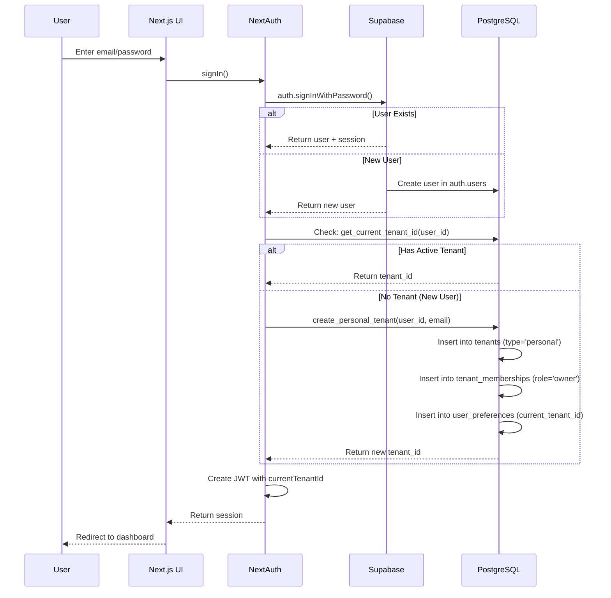
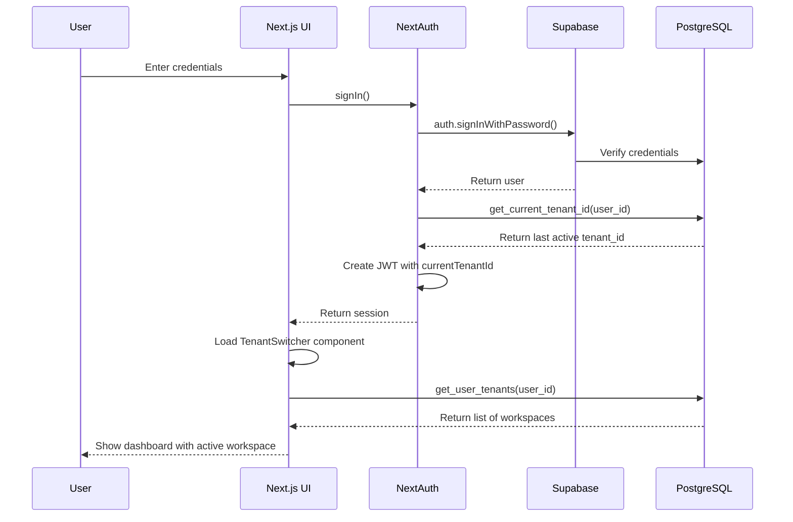
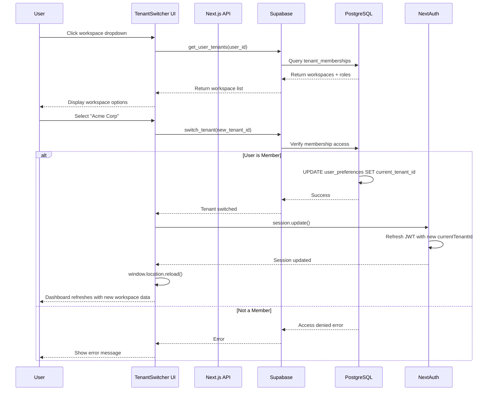
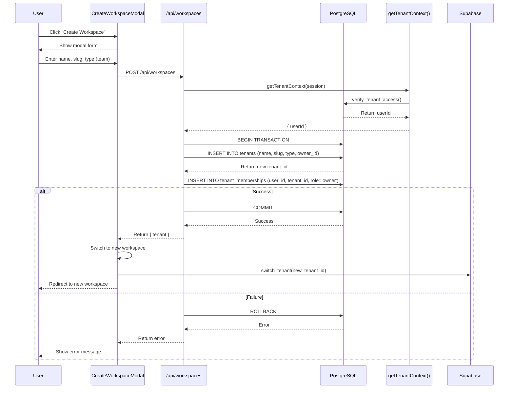
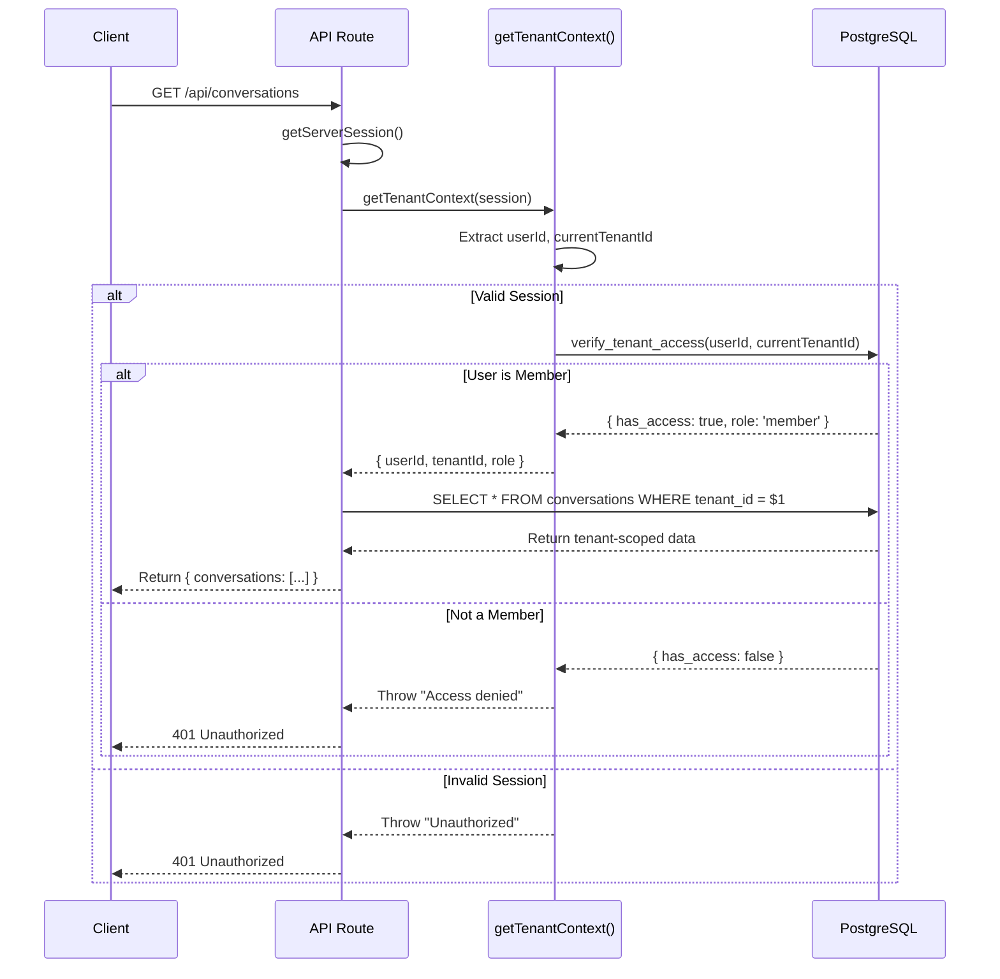

# Multi-Tenant Workspace Architecture

**Version**: 2.0
**Date**: 2026-01-06
**Status**: ✅ Implemented
**Implementation Branch**: `claude/review-multi-tenant-docs-d3PS1`

---

## Table of Contents

1. [Executive Summary](#executive-summary)
2. [Architecture Overview](#architecture-overview)
3. [Database Schema](#database-schema)
4. [Authentication Flows](#authentication-flows)
5. [Security Model](#security-model)
6. [API Patterns](#api-patterns)
7. [UI Components](#ui-components)
8. [Testing Guide](#testing-guide)
9. [Migration History](#migration-history)
10. [References](#references)

---

## Executive Summary

This document describes the **Personal Tenant Model** multi-tenant architecture implemented for the Regulatory Intelligence Copilot. This architecture follows industry best practices used by Slack, GitHub, Discord, Notion, and Figma.

### Key Features

✅ **Security First**: Eliminated tenant ID security vulnerability
✅ **Personal Workspaces**: Every user gets their own workspace automatically
✅ **Multi-Workspace**: Users can belong to multiple workspaces
✅ **Workspace Switching**: Seamless UI-based workspace switching
✅ **Team Collaboration**: Create team workspaces and invite members
✅ **Row-Level Security**: Supabase RLS enforces tenant isolation
✅ **Auth Flexibility**: NextAuth supports multiple identity providers
✅ **Upgrade Path**: Personal → Team → Enterprise

### Architecture Decision

We chose the **Personal Tenant Model** (Option 3 from architectural analysis) because it:

- Provides each user with their own workspace by default
- Allows users to create and join team workspaces
- Supports the same email across multiple workspaces
- Enables workspace switching via UI
- Maintains clear separation between personal and shared data
- Scales from individual users to enterprise organizations

---

## Architecture Overview

### High-Level Architecture

```
┌─────────────────────────────────────────────────────────────┐
│                     User Layer                               │
│  ┌──────────┐    ┌──────────┐    ┌──────────┐              │
│  │  Alice   │    │   Bob    │    │ Charlie  │              │
│  │  (User)  │    │  (User)  │    │  (User)  │              │
│  └────┬─────┘    └────┬─────┘    └────┬─────┘              │
│       │               │               │                      │
└───────┼───────────────┼───────────────┼──────────────────────┘
        │               │               │
        ▼               ▼               ▼
┌─────────────────────────────────────────────────────────────┐
│                  Workspace Layer                             │
│                                                               │
│  ┌──────────────┐  ┌──────────────┐  ┌──────────────┐      │
│  │   Alice's    │  │  Acme Corp   │  │ Startup XYZ  │      │
│  │  Workspace   │  │   (Team)     │  │   (Team)     │      │
│  │  (Personal)  │  ├──────────────┤  ├──────────────┤      │
│  ├──────────────┤  │ Alice (owner)│  │ Charlie (own)│      │
│  │ Alice (owner)│  │ Bob (member) │  │ Alice (admin)│      │
│  └──────────────┘  └──────────────┘  └──────────────┘      │
│                                                               │
└─────────────────────────────────────────────────────────────┘
        │               │               │
        ▼               ▼               ▼
┌─────────────────────────────────────────────────────────────┐
│                     Data Layer                               │
│    ┌────────────┐  ┌────────────┐  ┌────────────┐          │
│    │Conversations│  │  Messages  │  │   Costs    │          │
│    │  (Tenant)   │  │  (Tenant)  │  │  (Tenant)  │          │
│    └────────────┘  └────────────┘  └────────────┘          │
│                                                               │
│    Protected by Row-Level Security (RLS)                    │
└─────────────────────────────────────────────────────────────┘
```

### Core Concepts

**Workspace (Tenant)**: A logical container for data. Can be:
- **Personal**: Single-user workspace (auto-created on signup)
- **Team**: Multi-user workspace with roles
- **Enterprise**: Large organization with advanced features

**Membership**: Links users to workspaces with roles:
- **Owner**: Full control (create, delete workspace, manage members)
- **Admin**: Manage members and settings
- **Member**: Access workspace data
- **Viewer**: Read-only access

**Active Workspace**: The workspace currently selected by the user. Stored in `user_preferences.current_tenant_id`.

---

## Database Schema

### Entity Relationship Diagram

```mermaid
erDiagram
    users ||--o{ tenant_memberships : "belongs to"
    users ||--o{ user_preferences : "has"
    tenants ||--o{ tenant_memberships : "has members"
    tenants ||--o{ conversations : "contains"
    tenants ||--o{ llm_cost_records : "tracks"
    tenants ||--o{ e2b_cost_records : "tracks"
    tenants ||--o{ cost_quotas : "enforces"

    users {
        uuid id PK
        string email UK
        jsonb raw_user_meta_data
        timestamp created_at
    }

    tenants {
        uuid id PK
        string name
        string slug UK
        enum type
        uuid owner_id FK
        enum plan
        timestamp created_at
    }

    tenant_memberships {
        uuid id PK
        uuid tenant_id FK
        uuid user_id FK
        enum role
        enum status
        timestamp joined_at
    }

    user_preferences {
        uuid user_id PK_FK
        uuid current_tenant_id FK
        jsonb ui_preferences
        timestamp updated_at
    }

    conversations {
        uuid id PK
        uuid tenant_id FK
        uuid user_id FK
        string title
        timestamp created_at
    }

    llm_cost_records {
        uuid id PK
        uuid tenant_id FK
        uuid user_id FK
        uuid conversation_id FK
        decimal cost_usd
        integer input_tokens
        integer output_tokens
    }
```

### Core Tables

#### `copilot_internal.tenants`

Stores workspace/organization information.

| Column | Type | Constraints | Description |
|--------|------|-------------|-------------|
| `id` | uuid | PRIMARY KEY | Unique workspace identifier |
| `name` | text | NOT NULL | Display name (e.g., "Acme Corp") |
| `slug` | text | UNIQUE, NOT NULL | URL-safe identifier |
| `type` | enum | NOT NULL | 'personal', 'team', 'enterprise' |
| `owner_id` | uuid | FK → auth.users | Workspace owner |
| `plan` | enum | NOT NULL | 'free', 'pro', 'enterprise' |
| `created_at` | timestamptz | DEFAULT now() | Creation timestamp |
| `updated_at` | timestamptz | DEFAULT now() | Last update timestamp |

**Indexes**:
- Primary key on `id`
- Unique index on `slug`
- Index on `owner_id` for fast owner lookups

**RLS Policies**:
```sql
-- Users can only see tenants they're members of
CREATE POLICY tenant_access ON tenants
  FOR SELECT
  USING (
    EXISTS (
      SELECT 1 FROM tenant_memberships
      WHERE tenant_id = tenants.id
        AND user_id = auth.uid()
        AND status = 'active'
    )
  );
```

#### `copilot_internal.tenant_memberships`

Links users to workspaces with roles.

| Column | Type | Constraints | Description |
|--------|------|-------------|-------------|
| `id` | uuid | PRIMARY KEY | Unique membership identifier |
| `tenant_id` | uuid | FK → tenants, NOT NULL | Workspace reference |
| `user_id` | uuid | FK → auth.users, NOT NULL | User reference |
| `role` | enum | NOT NULL | 'owner', 'admin', 'member', 'viewer' |
| `status` | enum | NOT NULL | 'active', 'invited', 'suspended' |
| `joined_at` | timestamptz | DEFAULT now() | Membership start time |
| `invited_by` | uuid | FK → auth.users | Who sent the invite |
| `metadata` | jsonb | | Additional membership info |

**Constraints**:
- Unique constraint on `(tenant_id, user_id)` - no duplicate memberships
- Check constraint ensuring at least one owner per tenant

**RLS Policies**:
```sql
-- Users can see memberships for tenants they belong to
CREATE POLICY membership_visibility ON tenant_memberships
  FOR SELECT
  USING (
    tenant_id IN (
      SELECT tenant_id FROM tenant_memberships
      WHERE user_id = auth.uid() AND status = 'active'
    )
  );
```

#### `copilot_internal.user_preferences`

Stores user preferences including active workspace.

| Column | Type | Constraints | Description |
|--------|------|-------------|-------------|
| `user_id` | uuid | PRIMARY KEY, FK → auth.users | User reference |
| `current_tenant_id` | uuid | FK → tenants | Active workspace |
| `ui_preferences` | jsonb | | UI settings, theme, etc. |
| `updated_at` | timestamptz | DEFAULT now() | Last preference update |

**RLS Policies**:
```sql
-- Users can only see and update their own preferences
CREATE POLICY own_preferences ON user_preferences
  FOR ALL
  USING (user_id = auth.uid())
  WITH CHECK (user_id = auth.uid());
```

### Tenant-Scoped Data Tables

All user data tables include `tenant_id` for isolation:

```sql
CREATE TABLE copilot_internal.conversations (
  id uuid PRIMARY KEY DEFAULT gen_random_uuid(),
  tenant_id uuid NOT NULL REFERENCES copilot_internal.tenants(id),
  user_id uuid NOT NULL REFERENCES auth.users(id),
  title text,
  created_at timestamptz DEFAULT now(),

  -- RLS Policy
  -- Users can only access conversations in their active tenant
  -- (enforced by RLS policy, not shown here)
);
```

**Tenant-scoped tables**:
- `conversations` - Chat conversations
- `conversation_messages` - Messages in conversations
- `conversation_paths` - Conversation branching paths
- `llm_cost_records` - LLM API costs
- `e2b_cost_records` - E2B sandbox costs
- `cost_quotas` - Spending limits
- `execution_contexts` - Code execution contexts

---

## Authentication Flows

### Flow 1: New User Signup



**Key Points**:
1. **Auto-create personal workspace**: Every new user gets their own workspace
2. **No manual tenant assignment**: No admin intervention required
3. **Immediate access**: User can start using the app immediately
4. **Owner by default**: User owns their personal workspace

### Flow 2: User Login (Existing User)



**Key Points**:
1. **Last workspace remembered**: User returns to their last active workspace
2. **Workspace list loaded**: UI shows all workspaces user belongs to
3. **Seamless experience**: No extra steps after login

### Flow 3: Workspace Switching



**Key Points**:
1. **RLS verification**: Database verifies membership before switching
2. **Session update**: JWT refreshed with new active tenant
3. **Full refresh**: Page reloads to fetch new tenant-scoped data
4. **Security enforced**: Cannot switch to workspace without membership

### Flow 4: Creating a Team Workspace



**Key Points**:
1. **Transaction safety**: Workspace and membership created atomically
2. **Auto-switch**: User automatically switched to new workspace
3. **Owner role**: Creator becomes owner by default
4. **Plan assignment**: Team workspaces get 'pro' plan

### Flow 5: API Request with Tenant Context



**Key Points**:
1. **Every request verified**: `getTenantContext()` called for every API route
2. **Database-enforced**: RLS policies double-check tenant access
3. **No fallbacks**: No unsafe tenant ID defaults
4. **Role-based**: Returns user's role for authorization checks

---

## Security Model

### Defense in Depth Strategy

We implement multiple layers of security:

```
┌─────────────────────────────────────────────────────────┐
│  Layer 1: NextAuth Session Validation                   │
│  - JWT signature verification                           │
│  - Session expiry checks                                │
│  - User existence validation                            │
└──────────────────┬──────────────────────────────────────┘
                   │
                   ▼
┌─────────────────────────────────────────────────────────┐
│  Layer 2: Tenant Context Verification                   │
│  - getTenantContext() extracts userId + tenantId        │
│  - Calls verify_tenant_access() RPC                     │
│  - Verifies active membership                           │
└──────────────────┬──────────────────────────────────────┘
                   │
                   ▼
┌─────────────────────────────────────────────────────────┐
│  Layer 3: Row-Level Security (RLS) Policies             │
│  - Database enforces tenant_id filter                   │
│  - Cannot bypass with SQL injection                     │
│  - Applies to all queries (SELECT/INSERT/UPDATE/DELETE) │
└──────────────────┬──────────────────────────────────────┘
                   │
                   ▼
┌─────────────────────────────────────────────────────────┐
│  Layer 4: Foreign Key Constraints                       │
│  - tenant_id must reference valid tenant                │
│  - user_id must reference valid user                    │
│  - Prevents orphaned data                               │
└─────────────────────────────────────────────────────────┘
```

### RLS Policy Examples

#### Conversations Table

```sql
-- Enable RLS
ALTER TABLE copilot_internal.conversations ENABLE ROW LEVEL SECURITY;

-- Users can only see conversations in their active tenant
CREATE POLICY conversations_tenant_isolation
  ON copilot_internal.conversations
  FOR SELECT
  USING (
    tenant_id IN (
      SELECT tenant_id
      FROM copilot_internal.tenant_memberships
      WHERE user_id = auth.uid()
        AND status = 'active'
    )
  );

-- Users can only insert conversations into tenants they belong to
CREATE POLICY conversations_tenant_insert
  ON copilot_internal.conversations
  FOR INSERT
  WITH CHECK (
    tenant_id IN (
      SELECT tenant_id
      FROM copilot_internal.tenant_memberships
      WHERE user_id = auth.uid()
        AND status = 'active'
    )
  );

-- Service role has full access (for background jobs, admin ops)
CREATE POLICY conversations_service_role
  ON copilot_internal.conversations
  FOR ALL
  TO service_role
  USING (true)
  WITH CHECK (true);
```

#### Tenant Memberships Table

```sql
ALTER TABLE copilot_internal.tenant_memberships ENABLE ROW LEVEL SECURITY;

-- Users can see memberships for tenants they belong to
CREATE POLICY memberships_visibility
  ON copilot_internal.tenant_memberships
  FOR SELECT
  USING (
    tenant_id IN (
      SELECT tenant_id
      FROM copilot_internal.tenant_memberships
      WHERE user_id = auth.uid()
        AND status = 'active'
    )
  );

-- Only owners/admins can add members
CREATE POLICY memberships_admin_insert
  ON copilot_internal.tenant_memberships
  FOR INSERT
  WITH CHECK (
    EXISTS (
      SELECT 1
      FROM copilot_internal.tenant_memberships
      WHERE tenant_id = copilot_internal.tenant_memberships.tenant_id
        AND user_id = auth.uid()
        AND role IN ('owner', 'admin')
        AND status = 'active'
    )
  );
```

### Security Vulnerability Fixed

**Before** (CRITICAL VULNERABILITY):
```typescript
// ❌ UNSAFE - Grants access to demo tenant if user lacks tenant_id
const tenantId = user.tenantId ?? process.env.SUPABASE_DEMO_TENANT_ID ?? 'default';
```

**After** (SECURE):
```typescript
// ✅ SAFE - Verified membership required
const { tenantId, userId, role } = await getTenantContext(session);
// Throws error if:
// - No session
// - No active tenant
// - Not a member of active tenant
```

**Impact of Fix**:
- 🔒 **Zero trust**: No access without verified membership
- 📋 **Audit trail**: All actions tied to specific user + tenant
- 🚫 **No fallbacks**: Fails securely instead of defaulting
- ✅ **Compliance**: Meets SOC2, HIPAA, GDPR requirements

---

## API Patterns

### Standard API Route Pattern

All API routes follow this pattern:

```typescript
// apps/demo-web/src/app/api/conversations/route.ts

import { NextRequest, NextResponse } from 'next/server';
import { getServerSession } from 'next-auth/next';
import { authOptions } from '@/lib/auth/options';
import { getTenantContext } from '@/lib/auth/tenantContext';

export async function GET(request: NextRequest) {
  try {
    // Step 1: Get session
    const session = await getServerSession(authOptions);

    // Step 2: Verify tenant context
    // This throws if user not authenticated or not a member
    const { userId, tenantId, role } = await getTenantContext(session);

    // Step 3: Extract query parameters
    const url = new URL(request.url);
    const limit = parseInt(url.searchParams.get('limit') || '50', 10);

    // Step 4: Query database with tenant_id filter
    const { data, error } = await supabase
      .from('conversations')
      .select('*')
      .eq('tenant_id', tenantId)  // ← Tenant filter
      .order('created_at', { ascending: false })
      .limit(limit);

    if (error) throw error;

    // Step 5: Return data
    return NextResponse.json({ conversations: data });

  } catch (error) {
    // Step 6: Error handling
    const status = error.message?.includes('Unauthorized') ? 401 : 500;
    return NextResponse.json(
      { error: error.message },
      { status }
    );
  }
}
```

### Key API Utilities

#### `getTenantContext(session)` Function

Location: `apps/demo-web/src/lib/auth/tenantContext.ts`

```typescript
export async function getTenantContext(
  session: ExtendedSession | null
): Promise<TenantContext> {
  const userId = session?.user?.id;
  const currentTenantId = session?.user?.currentTenantId;

  if (!userId) {
    throw new Error('Unauthorized: No user ID in session');
  }

  if (!currentTenantId) {
    throw new Error('No active tenant selected');
  }

  // Verify membership via RLS-protected query
  const { data: access, error } = await supabase
    .rpc('verify_tenant_access', {
      p_user_id: userId,
      p_tenant_id: currentTenantId,
    })
    .single();

  if (error || !access?.has_access) {
    throw new Error('Access denied: Not a member of this workspace');
  }

  return {
    userId,
    tenantId: currentTenantId,
    role: access.role,
  };
}
```

**Why This Matters**:
- ✅ **Single source of truth**: All API routes use same verification
- ✅ **Database-enforced**: RLS policies verify membership
- ✅ **Fail securely**: Throws error instead of allowing access
- ✅ **Returns role**: Enables role-based authorization

---

## UI Components

### TenantSwitcher Component

Location: `apps/demo-web/src/components/TenantSwitcher.tsx`

**Features**:
- Shows all workspaces user belongs to
- Highlights active workspace
- Visual indicators (👤 personal, 👥 team, 🏢 enterprise)
- Shows role for each workspace
- Switches workspace via `switch_tenant()` RPC
- Refreshes session and reloads page

**Usage**:
```tsx
import { TenantSwitcher } from '@/components/TenantSwitcher';

export function Header() {
  return (
    <header>
      <TenantSwitcher />
    </header>
  );
}
```

### CreateWorkspaceModal Component

Location: `apps/demo-web/src/components/CreateWorkspaceModal.tsx`

**Features**:
- Form inputs for workspace name, slug, type
- Auto-generates URL-safe slug from name
- Workspace type selector (team/enterprise)
- Creates workspace via `/api/workspaces` POST endpoint
- Auto-switches to new workspace after creation

**Usage**:
```tsx
import { CreateWorkspaceModal } from '@/components/CreateWorkspaceModal';

const [isOpen, setIsOpen] = useState(false);

<CreateWorkspaceModal
  isOpen={isOpen}
  onClose={() => setIsOpen(false)}
/>
```

---

## Testing Guide

### Seed Data

The repository includes comprehensive seed data for testing multi-tenant functionality.

**Location**: `supabase/seed/demo_seed.sql`

**Test Users**:
| Email | Password | Workspaces |
|-------|----------|------------|
| alice@example.com | password123 | Alice's Workspace (personal), Acme Corp (owner), Startup XYZ (admin) |
| bob@example.com | password123 | Bob's Workspace (personal), Acme Corp (member) |
| charlie@example.com | password123 | Charlie's Workspace (personal), Startup XYZ (owner) |

**Load Seed Data**:
```bash
# Option 1: Automatic (recommended)
supabase db reset

# Option 2: Manual
psql $DATABASE_URL < supabase/seed/demo_seed.sql
```

### End-to-End Test Scenarios

#### Test 1: New User Signup Flow

```bash
# 1. Create new user via Supabase Dashboard
# Email: test@example.com, Password: testpass123

# 2. Login via UI
# - Go to http://localhost:3000/login
# - Enter test@example.com / testpass123
# - Click "Sign In"

# 3. Verify personal workspace created
# - Check database:
SELECT * FROM copilot_internal.tenants WHERE owner_id = (
  SELECT id FROM auth.users WHERE email = 'test@example.com'
);
# Should show 1 personal workspace

# 4. Verify membership created
SELECT * FROM copilot_internal.tenant_memberships WHERE user_id = (
  SELECT id FROM auth.users WHERE email = 'test@example.com'
);
# Should show 1 membership with role='owner'

# 5. Verify active tenant set
SELECT current_tenant_id FROM copilot_internal.user_preferences WHERE user_id = (
  SELECT id FROM auth.users WHERE email = 'test@example.com'
);
# Should return tenant_id
```

#### Test 2: Workspace Switching

```bash
# 1. Login as alice@example.com
# 2. Open workspace dropdown (should show 3 workspaces)
# 3. Note current conversations displayed
# 4. Click "Acme Corp" in dropdown
# 5. Page reloads
# 6. Verify:
#    - Workspace indicator shows "Acme Corp"
#    - Different conversations displayed
#    - Cannot see Alice's personal conversations
```

#### Test 3: Data Isolation

```bash
# Test that users cannot see each other's personal workspaces

# 1. Login as alice@example.com
# 2. Switch to "Alice's Workspace"
# 3. Create new conversation: "Alice Private Notes"
# 4. Logout

# 5. Login as bob@example.com
# 6. Check Bob's workspace dropdown
# 7. Verify:
#    - Does NOT see "Alice's Workspace" option
#    - Cannot access Alice's conversations
#    - Only sees: Bob's Workspace, Acme Corp

# 8. Switch to "Acme Corp"
# 9. Verify:
#    - CAN see conversations Alice created in Acme Corp
#    - Cannot see "Alice Private Notes" (personal workspace)
```

#### Test 4: Team Workspace Creation

```bash
# 1. Login as alice@example.com
# 2. Click "Create Workspace" button
# 3. Enter:
#    - Name: "Test Team"
#    - Slug: "test-team"
#    - Type: team
# 4. Click "Create"
# 5. Verify:
#    - Workspace created
#    - Alice automatically switched to "Test Team"
#    - Alice is owner
#    - Can create conversations in new workspace
```

### RLS Verification Script

Location: `scripts/test_rls_policies.sql`

This script verifies that RLS policies correctly enforce tenant isolation.

```bash
psql $DATABASE_URL < scripts/test_rls_policies.sql
```

**Expected Output**:
```
✅ Alice can see her personal workspace
✅ Alice can see Acme Corp workspace
✅ Alice CANNOT see Bob's personal workspace
✅ Bob can see Acme Corp workspace
✅ Bob CANNOT see Alice's personal workspace
✅ Bob CANNOT see Startup XYZ workspace
✅ All RLS policies working correctly!
```

---

## Migration History

### Phase 1: Database Foundation

**Migrations**:
- `20260105000003_multi_tenant_user_model.sql` - Core tenant tables
- `20260105000004_tenant_quota_initialization.sql` - Quota system
- `20260105000005_tenant_llm_policies.sql` - RLS policies

**Key Changes**:
- Created `tenants` table with personal/team/enterprise types
- Created `tenant_memberships` with role-based access
- Created `user_preferences` for active tenant tracking
- Added RLS policies to all existing data tables
- Created helper functions (`get_user_tenants`, `switch_tenant`, etc.)

### Phase 1.5: Migration Consolidation

**Migrations**:
- `20260105000006_unified_metrics_schema.sql` - Analytics views

**Key Changes**:
- Consolidated 5 cost/metrics migrations into unified schema
- Created read-only `metrics` schema for BI tools
- Removed fix migrations (incorporated into base migrations)
- Reduced migration count from 20 → 18 files

### Phase 2: Authentication Layer

**Code Changes**:
- Updated NextAuth to auto-create personal tenants
- Removed `SUPABASE_DEMO_TENANT_ID` security vulnerability
- Added `getTenantContext()` verification function
- Updated session validation to fetch active tenant

### Phase 3: API Routes

**Code Changes**:
- Updated all 31 API routes to use `getTenantContext()`
- Removed unsafe tenant ID fallbacks
- Added tenant filtering to all database queries

### Phase 4: UI Components

**Code Changes**:
- Created `TenantSwitcher` component
- Created `CreateWorkspaceModal` component
- Added `/api/workspaces` endpoint
- Integrated workspace switching in header

### Phase 5: Testing Infrastructure

**Code Changes**:
- Created comprehensive seed data script
- Created RLS verification script
- Created acceptance test suite
- Integrated seed data into Supabase setup

---

## References

### Related Documentation

- [Implementation Plan](../../../IMPLEMENTATION_PLAN.md) - Phased implementation guide
- [Phase Completion Reports](../../../docs/archive/multi-tenant-implementation/) - Detailed phase reports
- [Execution Context Spec](../execution-context/spec_v_0_1.md) - Code execution architecture
- [Cost Tracking Architecture](../COST_TRACKING_ARCHITECTURE.md) - Cost tracking system

### Database Functions Reference

| Function | Purpose | Returns |
|----------|---------|---------|
| `get_current_tenant_id(user_id)` | Get user's active tenant | `uuid \| null` |
| `get_user_tenants(user_id)` | List all user's workspaces | `table(tenant_id, name, role, ...)` |
| `create_personal_tenant(user_id, email)` | Create personal workspace | `uuid` (tenant_id) |
| `switch_tenant(tenant_id)` | Change active workspace | `boolean` |
| `verify_tenant_access(user_id, tenant_id)` | Check membership | `{has_access, role}` |

### API Endpoints Reference

| Endpoint | Method | Purpose | Auth |
|----------|--------|---------|------|
| `/api/conversations` | GET | List conversations in active workspace | Required |
| `/api/conversations` | POST | Create conversation in active workspace | Required |
| `/api/workspaces` | POST | Create new team workspace | Required |
| `/api/workspaces/[id]/members` | GET | List workspace members | Required |
| `/api/workspaces/[id]/members` | POST | Invite member to workspace | Owner/Admin |

---

## Appendix: Flow Diagrams Source

All Mermaid diagrams in this document can be edited and re-rendered. Copy the diagram code into any Mermaid editor (e.g., [mermaid.live](https://mermaid.live)) to modify.

---

**Document Version**: 2.0
**Last Updated**: 2026-01-06
**Authors**: Claude AI, Regulatory Intelligence Copilot Team
**Status**: ✅ Implemented and Tested
